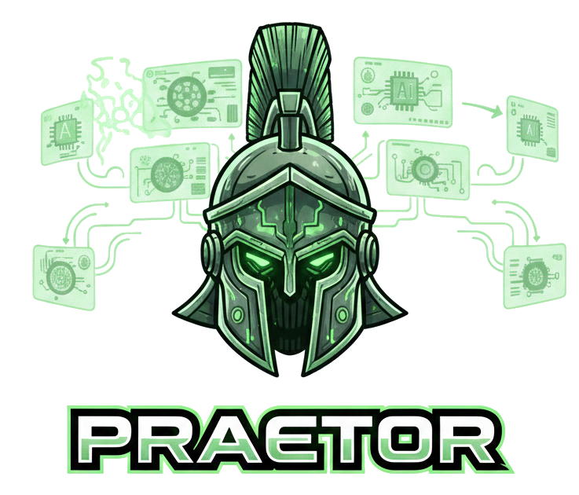

    
    

    
Lead. Delegate. Dominate.

# Praetor Documentation

`praetor` is a Go CLI that orchestrates AI agent providers through a single execution surface. It drives 9 agents (Claude, Codex, Copilot, Gemini, Kimi, LM Studio, OpenCode, OpenRouter, and Ollama) through CLI and REST transports, coordinated by an executor/reviewer pipeline with:

- **Parallel execution** — dependency-aware concurrent task waves (default: 5 parallel)
- **Structured output** — JSON schema enforcement for planner, executor, and reviewer
- **Automatic fallback** — error-classified failover to alternate agents
- **Middleware pipeline** — composable logging and metrics around every invocation
- **Structured observability** — JSONL event stream for post-run analysis
- **Intelligent routing** — automatic executor selection from available agents
- **Worktree isolation** — each task runs in a dedicated git worktree
- **Crash recovery** — transactional snapshots with atomic writes
- **Brief persistence** — original plan briefs saved before agent generation

## Core documentation

- [Architecture](architecture.md) — package boundaries, execution flow, and design rationale
- [Pipeline orchestration](orchestration.md) — plan format, runtime model, safety mechanisms, and CLI reference
- [Configuration](configuration.md) — config file format, CLI commands, and full key reference
- [MCP Server](mcp.md) — Model Context Protocol server for AI agent interoperability
- [Shared Agent Commands](commands.md) — cross-agent slash commands from a single source of truth
- [Operations Runbook](operations-runbook.md) — local operational triage flow using `plan eval` and project `eval`
- [Providers overview](providers/README.md) — agent interface, runner abstraction, registry, middleware, and fallback

## Provider documentation

- [Claude](providers/claude.md) — stream-json JSONL protocol, PTY streaming, cost tracking
- [Codex](providers/codex.md) — exec --json JSONL events, sandbox and approval policies
- [Copilot](providers/copilot.md) — GitHub Copilot CLI adapter
- [Gemini](providers/gemini.md) — Gemini CLI with PTY streaming
- [Kimi](providers/kimi.md) — Kimi CLI with stdin/PTY delivery
- [LM Studio](providers/lmstudio.md) — local OpenAI-compatible REST API, optional auth
- [OpenCode](providers/opencode.md) — OpenCode run --quiet adapter
- [OpenRouter](providers/openrouter.md) — OpenAI-compatible Chat Completions REST API, 300+ models
- [Ollama](providers/ollama.md) — local REST API for open-source models

## Documentation standard

- All technical documentation is written in English.
- `docs/` is the canonical source for project documentation, served with docsify.
- Provider-specific `README.md` files inside `internal/` are minimal pointers to canonical docs here.
