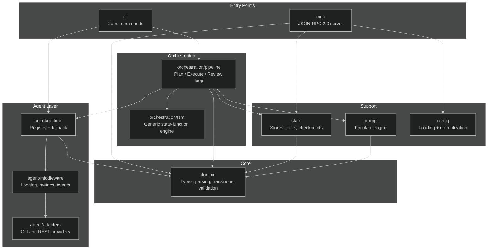
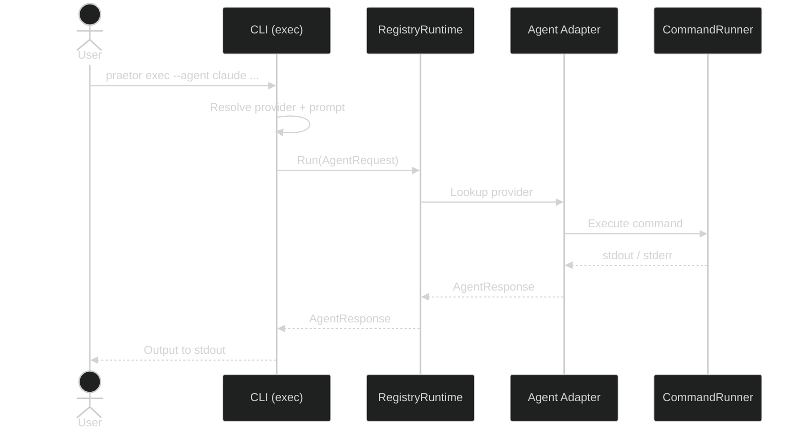
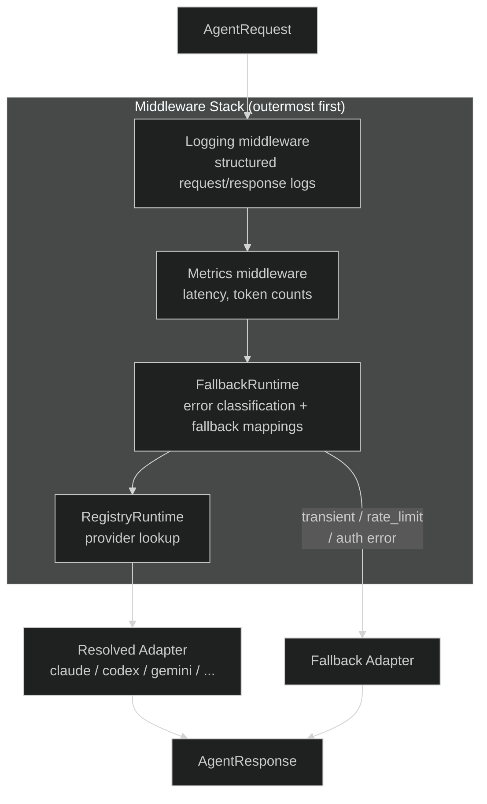
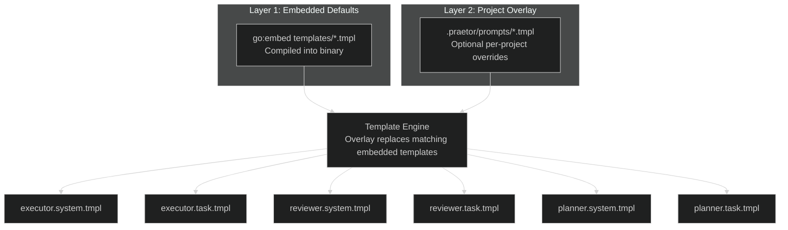

# Architecture

## Overview

`praetor` is a CLI-first orchestrator with two primary execution paths:

- **Plan orchestration**: `praetor plan run <slug>`
- **Single dispatch**: `praetor exec`

Providers supported by the unified agent abstraction:

- `claude` (CLI)
- `codex` (CLI)
- `copilot` (CLI)
- `gemini` (CLI)
- `kimi` (CLI)
- `lmstudio` (REST)
- `opencode` (CLI)
- `openrouter` (REST)
- `ollama` (REST)

## Package boundaries

```text
cmd/praetor/                      CLI entrypoint
internal/
├── agent/                        Provider abstraction + adapters + middleware
│   ├── adapters/                 CLI and REST implementations
│   ├── middleware/               Logging, metrics, event sinks
│   ├── runner/                   Command execution abstraction
│   ├── runtime/                  Registry + fallback runtime
│   └── text/                     Prompt/output helpers
├── app/                          Bootstrap and dependency wiring
├── cli/                          Cobra commands and renderer
├── commands/                     Shared agent commands (sync + templates)
├── config/                       Config loading, normalization, and plan template registry
├── domain/                       Core types, parsing, transitions, validation
├── mcp/                          MCP server (JSON-RPC 2.0 over stdio)
├── orchestration/
│   ├── fsm/                      Generic state-function engine
│   └── pipeline/                 Plan/Execute/Review loop + cognitive agents
├── prompt/                       Template engine (embedded + overlay)
├── runtime/                      Process, PTY, tmux execution backends
├── state/                        Stores, feedback logs, locks, checkpoints, snapshots
└── workspace/                    Project root/manifest resolution
```



## Domain model

`internal/domain` is dependency-free and centralizes:

- Plan schema (`Plan`, `Task`, `PlanSettings`, `PlanQuality`, `ExecutionPolicy`, `PlanCognitive`, `TaskConstraints`, `TaskAgents`)
- Mutable run state (`State`, `StateTask`, `TaskStatus`, `TaskFeedback`, `EventActor`)
- Runtime config (`RunnerOptions`)
- Run diagnostics (`ActorStats`, `RunSummary`)
- Parsing contracts (`ParseExecutorResult`, `ParseReviewDecision`, `ParseGateEvidence`)
- Transitions/graph (`Transition`, `RunnableTaskIndices`, blocked-dependency reporting)

Plan loading uses strict decode with `DisallowUnknownFields()`.

The schema includes:
- `cognitive` — planning metadata (assumptions, open questions, failure modes, decisions)
- `task.constraints` — per-task tool restrictions and timeout overrides
- `task.agents` — per-task executor/reviewer agent and model overrides

## Execution flows

### `praetor exec`

1. CLI resolves provider and prompt.
2. Runtime registry resolves adapter.
3. Agent executes.
4. Output is written to stdout.



### `praetor plan run <slug>`

1. Resolve project root and workspace manifest.
2. Load plan and state store.
3. Merge runtime options with precedence (`CLI > plan.settings > resolved config file > defaults`).
4. Build runtime stack with shared event sink.
5. Run loop FSM:
   - select runnable task
   - execute
   - review/gates
   - apply outcome
   - persist snapshots/events/metrics
6. Finalize run with explicit `RunOutcome` and exit code.

## Runtime composition

The runtime is assembled as decorators:

```text
Logging middleware
  └── Metrics middleware
       └── FallbackRuntime
            └── RegistryRuntime
```



`FallbackRuntime` uses error classification (`transient`, `auth`, `rate_limit`, `unsupported`, `unknown`) plus configured fallback mappings.

## Prompt system

`internal/prompt` loads templates in two layers:

1. Embedded defaults (`go:embed`)
2. Optional project overlay (`.praetor/prompts/*.tmpl`)



Available templates:

| Template | Purpose |
|---|---|
| `executor.system.tmpl` | executor role/system instructions |
| `executor.task.tmpl` | task payload, retries, acceptance, required gates |
| `reviewer.system.tmpl` | reviewer role/system instructions |
| `reviewer.task.tmpl` | task payload, executor output, git diff |
| `planner.system.tmpl` | planner schema instructions |
| `planner.task.tmpl` | objective/brief payload |
| `adapter.plan.tmpl` | provider-shared planning prompt |
| `adapter.plan.claude.tmpl` | Claude-specific planning prompt |

## Observability and diagnostics

Structured runtime diagnostics are persisted per run:

- `runtime/<run-id>/events.jsonl`
- `runtime/<run-id>/diagnostics/performance.jsonl`
- `runtime/<run-id>/snapshot.json`

Emitted events include:

- `agent_start`, `agent_complete`, `agent_error`, `agent_fallback`
- `task_started`, `task_completed`, `task_failed`, `task_stalled`
- `prompt_budget_warning`, `cost_budget_warning`, `cost_budget_exceeded`
- `gate_result`, `parallel_merge`, `parallel_conflict`, `state_transition`

This stream is consumed by `praetor plan diagnose`.

## State and recovery

Project data is isolated under `<praetor-home>/projects/<project-key>/`:

- `plans/` plan files
- `state/` mutable state
- `feedback/` structured retry feedback logs
- `locks/` run locks
- `checkpoints/` transition ledger
- `costs/` cost metrics
- `logs/` per-invocation logs
- `runtime/<run-id>/` transactional snapshots + diagnostics

Recovery behavior:

- latest valid snapshot may restore newer state
- checksum mismatch prevents stale/foreign restore
- transient in-progress states are reset to `pending` on load

## Intelligent routing

Agent availability is probed at bootstrap. Executor routing uses plan-level defaults and availability:

1. Use configured default executor when healthy.
2. Otherwise auto-select from available executors (CLI preferred over REST).

The plan schema supports per-task agent overrides via the `task.agents` field. When a task declares `agents.executor` or `agents.reviewer`, those override the plan-level defaults for that task only.

## MCP server

`internal/mcp` implements a [Model Context Protocol](https://modelcontextprotocol.io/) server over stdio, exposing praetor's capabilities as MCP tools and resources. See [MCP Server](mcp.md) for details.

## Shared agent commands

`internal/commands` generates shared agent commands in `.agents/commands/` with symlinks to `.claude/`, `.cursor/`, `.codex/`. See [Shared Agent Commands](commands.md) for details.

## Design principles

- CLI-first operational UX
- Strict schemas and explicit failure modes
- Filesystem as auditable source of truth
- Prompt-budgeted execution for predictable orchestration
- Event-driven diagnostics without mandatory UI/dashboard
- MCP integration for AI agent interoperability
