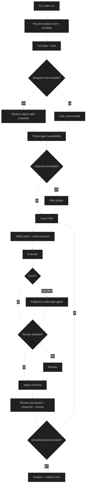

# Architecture

## Overview

`praetor` is a CLI-first orchestrator with two execution modes:

- **Plan-driven execution** (`praetor plan run <slug>`) with Plan/Execute/Review phases.
- **Single-prompt dispatch** (`praetor exec`) through a centralized multi-provider `Agent` abstraction.

Built-in providers:

- `claude` (CLI)
- `codex` (CLI)
- `copilot` (CLI)
- `gemini` (CLI)
- `kimi` (CLI)
- `opencode` (CLI)
- `openrouter` (REST)
- `ollama` (REST)

## Package boundaries

```text
cmd/praetor/                      CLI entrypoint
internal/
├── agent/                        Central polymorphic Agent interface
│   ├── adapters/                 CLI and REST adapter implementations (8 providers)
│   ├── middleware/               Middleware pipeline (logging, metrics, event sinks)
│   ├── runner/                   Command execution abstraction (exec, PTY, process adapter)
│   ├── runtime/                  Registry runtime, fallback runtime, default wiring
│   └── text/                     Prompt composition and output parsing helpers
├── app/                          Bootstrap, dependency wiring, root resolution
├── cli/                          Cobra command wiring + terminal renderer + doctor
├── config/                       Config loader (`config.toml`, global + per-project)
├── domain/                       Pure domain types (Plan, Task, State, Agent, transitions, graph)
├── orchestration/
│   ├── fsm/                      Generic functional state machine (stateFn pattern)
│   └── pipeline/                 Plan/Execute/Review runner, cognitive agents, prompts, runtime composition, router
├── runtime/
│   ├── process/                  Non-interactive subprocess execution
│   ├── pty/                      Interactive pseudo-terminal sessions (start/read/write/close)
│   └── tmux/                     Tmux-based runner with session management
├── state/                        Snapshots, checkpoints, locks, XDG paths
└── workspace/                    Git root resolution and `praetor.{yaml,yml,md}` loading
```

## Agent layer

`internal/agent` is the canonical provider abstraction. It defines the polymorphic `Agent` interface
and all associated types (`ID`, `Transport`, `Capabilities`, request/response contracts).

Key sub-packages:

- **`agent/adapters/`** — One file per provider (8 adapters: claude, codex, copilot, gemini, kimi, opencode, openrouter, ollama). Each implements `agent.Agent`.
- **`agent/middleware/`** — Composable `Middleware` type (same pattern as `http.Handler` middleware). Includes `Logging`, `Metrics`, event types, and event sinks (`JSONLSink`, `MultiplexSink`, `NopSink`).
- **`agent/runtime/`** — `RegistryRuntime` routes requests through the `agent.Registry`; `FallbackRuntime` wraps it with error-class-based automatic failover.
- **`agent/catalog.go`** — Single source of truth for all agent metadata (binary names, transports, capabilities, install hints).
- **`agent/probe.go`** — Health-check prober for CLI and REST agents (used by `praetor doctor` and intelligent routing).

## Domain layer

`internal/domain` is the single source of truth for all domain types. It has zero
internal dependencies (only Go stdlib). Other packages import from domain directly.

Key contents:

- **Types:** `Agent`, `Plan`, `Task`, `TaskStatus`, `StateTask`, `State`, `RunnerOptions`,
  `AgentRequest`, `AgentResult`, `CommandSpec`, `ProcessResult`, `CostEntry`, `CheckpointEntry`,
  `PlanStatus`, `ExecutorResult`, `ReviewDecision`.
- **Interfaces:** `AgentSpec`, `ProcessRunner`, `SessionManager`, `AgentRuntime`, `RenderSink`.
- **Transitions:** `ValidTransitions`, `Transition()`, `IsTerminal()`, `NormalizeStatus()`.
- **Graph:** `NextRunnableTask()`, `RunnableTasks()`, `BlockedTasksReport()`.
- **Parsing:** `ParseExecutorResult()`, `ParseReviewDecision()`.
- **Plan helpers:** `LoadPlan()`, `ValidatePlan()`, `NewPlanFile()`, `PlanChecksum()`.

## Execution flow

### `praetor exec`

1. CLI resolves provider and prompt.
2. CLI builds the default `agent.Registry` (CLI + REST adapters).
3. Selected `Agent` executes prompt through `Execute(...)`.
4. Response is printed to stdout.

### `praetor plan run <slug>`

1. CLI resolves plan slug, workdir, and merged config.
2. Runner resolves git project root and reads workspace manifest (`praetor.yaml`, `praetor.yml`, fallback `praetor.md`).
3. Runner initializes project state store and acquires run lock.
4. Runner restores from latest local project snapshot when newer.
5. Runner probes agent availability (CLI binary detection + REST health checks).
6. Optional planner phase (`--objective`) generates a plan before execution.
7. Main loop runs as FSM (`stateFn`) with explicit transitions:
   - guard/cancellation checks
   - task selection (with intelligent routing from available agents)
   - execute (with automatic fallback on classified errors)
   - review
   - finalize
8. Each transition persists:
   - mutable plan state
   - checkpoints/metrics
   - transactional local snapshot (`<project-home>/runtime/<run-id>/snapshot.json` + journal)
   - structured execution events (`events.jsonl`)
9. Runner exits on completion, cancellation, blockage, or iteration cap.



## Orchestration

### FSM (`internal/orchestration/fsm`)

Generic functional state machine using `StateFn[S any]` — a function that takes
context and state, returning the next state function or nil to halt. Inspired by
Rob Pike's lexer pattern, generalized with Go generics.

### Pipeline (`internal/orchestration/pipeline`)

Contains the full Plan/Execute/Review orchestration engine:

- **Phase rules:** Plan/Execute/Review/Gate sequence and valid transitions.
- **Runner:** Dependency-aware plan executor with retries, review gates, and isolation.
- **Cognitive agents:** Polymorphic `CognitiveAgent` interface for Plan/Execute/Review.
- **Prompts:** System and task prompt builders for executor, reviewer, and planner.
- **Runtime composition:** layered `BuildAgentRuntime` factory that assembles `RegistryRuntime` → `FallbackRuntime` → `Logging` → `Metrics` middleware chain, preserving `SessionManager` delegation via `composedRuntime`.
- **Router:** `resolveExecutorWithRouting()` intelligently selects an executor from available agents when the default is unreachable, preferring CLI over REST transport.

## Runtime model

`pipeline.Runner` chooses mode-specific process execution strategy through one runtime contract:

- `tmux`: same `agent.Agent` contract backed by tmux session/process adapter.
- `direct`: same contract with non-PTY subprocess execution.
- `pty`: same contract with PTY-first subprocess execution.

The cognitive strategy is **Plan-and-Execute** with explicit **Review gate**:

- `Plan`: macro decomposition
- `Execute`: isolated task execution
- `Review`: independent verification

### Layered runtime

The runtime is assembled as a decorator stack:

```text
RegistryRuntime          (routes by agent ID to CLI/REST adapters)
  └── FallbackRuntime    (retries with alternate agent on classified errors)
       └── Logging       (structured log entries + event emission)
            └── Metrics  (thread-safe invocation counters and cost tracking)
```

`FallbackRuntime` classifies errors into `transient`, `auth`, `rate_limit`, `unsupported`, or `unknown` and resolves a fallback agent via per-agent mappings or global class-based policies.

## Error taxonomy

`agent.ClassifyError()` pattern-matches on error strings from all 8 adapters:

| Class | Patterns |
|-------|----------|
| `transient` | connection refused, timeout, 502, 503, 504, network unreachable, eof |
| `auth` | 401, 403, api key, unauthorized, forbidden |
| `rate_limit` | 429, rate limit, too many requests |
| `unsupported` | unsupported, not implemented, not supported |
| `unknown` | everything else |

## Middleware pipeline

`agent/middleware.Middleware` is a function type `func(next AgentRuntime) AgentRuntime`, composed with `Chain(base, A, B)` → `A(B(base))`. Built-in middleware:

- **Logging**: captures timestamp, agent, role, status, error, duration, cost; emits `ExecutionEvent` to an `EventSink`.
- **Metrics**: thread-safe `Counters` keyed by `(agent, role, status)` with total cost and call count.

## Observability

Execution events are emitted as JSONL to `<run-dir>/events.jsonl`:

```json
{"timestamp":"...","type":"agent_complete","agent":"claude","role":"execute","duration_s":12.3,"cost_usd":0.05}
```

Event types: `agent_start`, `agent_complete`, `agent_error`, `agent_fallback`.

Sinks: `JSONLSink` (file), `MultiplexSink` (fan-out), `NopSink` (disabled), `CollectorSink` (tests).

## PTY model

`internal/runtime/pty` exposes interactive sessions with first-class operations:

- `Start(ctx, spec)`
- `Events() <-chan StreamEvent`
- `Write(input)`
- `CloseInput()`
- `Wait()`
- `Close()`

This enables bidirectional interaction with CLI tools that require a real TTY.

## Process runner

`internal/runtime/process` provides non-interactive subprocess execution with
stdout/stderr capture and optional file persistence. Used by direct-mode runners
and agent specs that invoke CLI tools without a TTY.

## State and recovery

All state lives under a single project home directory (`<praetor-home>/projects/<project-key>/`):

- **Project state**: canonical mutable execution state, checkpoints, locks, logs, plans.
- **Transactional snapshots**: `<project-home>/runtime/<run-id>/` for crash-safe recovery.

Snapshot files:

- `snapshot.json`
- `events.log`
- `events.jsonl` (structured execution events)
- `lock.json`
- `meta.json`

Writes are atomic (`tmp + rename`) and synced (`fsync`) on critical paths.
`meta.json` stores snapshot checksum (`snapshot_sha256`) for integrity checks on recovery.
Local run retention is enforced with `keep-last-runs` pruning and explicit resume is available via `praetor plan resume`.

## Design principles

- Small packages with clear ownership.
- Explicit interfaces over implicit coupling.
- Provider transport isolation (CLI and REST behind one `Agent` contract).
- Domain types in a single, dependency-free package.
- Workspace context anchored at repository root.
- FSM-driven orchestration to avoid nested, brittle control flow.
- Transactional recovery by default.
- Decorator-based runtime composition (fallback, logging, metrics) without modifying core adapters.
- Error classification enables automatic failover without adapter changes.
