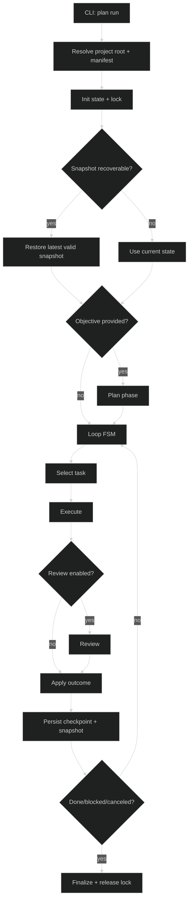

# Architecture

## Overview

`praetor` is a CLI-first orchestrator with two execution modes:

- **Plan-driven execution** (`praetor plan run <plan-file>`) with Plan/Execute/Review phases.
- **Single-prompt dispatch** (`praetor exec`) through a centralized multi-provider `Agent` abstraction.

Built-in providers:

- `codex` (CLI)
- `claude` (CLI)
- `gemini` (CLI)
- `ollama` (REST)

## Package boundaries

```text
cmd/praetor/                      CLI entrypoint
internal/
├── agents/                       Central polymorphic Agent interface + adapters (CLI/REST)
├── app/                          Bootstrap, dependency wiring, root resolution
├── cli/                          Cobra command wiring + terminal renderer
├── config/                       Config loader (`config.toml`, global + per-project)
├── domain/                       Pure domain types (Plan, Task, State, Agent, transitions, graph)
├── orchestration/
│   ├── fsm/                      Generic functional state machine (stateFn pattern)
│   └── pipeline/                 Plan/Execute/Review runner, cognitive agents, prompts, runtime composition
├── providers/                    Provider catalog and SDK ports
│   ├── claude/                   Claude CLI adapter + AgentSpec
│   └── codex/                    Codex CLI adapter + AgentSpec
├── runtime/
│   ├── process/                  Non-interactive subprocess execution
│   ├── pty/                      Interactive pseudo-terminal sessions (start/read/write/close)
│   └── tmux/                     Tmux-based runner with session management
├── state/                        Snapshots, checkpoints, locks, XDG paths, migration
└── workspace/                    Git root resolution and `praetor.{yaml,yml,md}` loading
```

## Domain layer

`internal/domain` is the single source of truth for all domain types. It has zero
internal dependencies (only Go stdlib). Other packages import from domain and may
re-export via type aliases for backward compatibility.

Key contents:

- **Types:** `Agent`, `Plan`, `Task`, `TaskStatus`, `StateTask`, `State`, `RunnerOptions`,
  `AgentRequest`, `AgentResult`, `CommandSpec`, `ProcessResult`, `CostEntry`, `CheckpointEntry`,
  `PlanStatus`, `ExecutorResult`, `ReviewDecision`.
- **Interfaces:** `AgentSpec`, `ProcessRunner`, `SessionManager`, `AgentRuntime`, `RenderSink`.
- **Transitions:** `ValidTransitions`, `Transition()`, `IsTerminal()`, `NormalizeStatus()`.
- **Graph:** `NextRunnableTask()`, `RunnableTasks()`, `BlockedTasksReport()`.
- **Parsing:** `ParseExecutorResult()`, `ParseReviewDecision()`.
- **Plan helpers:** `LoadPlan()`, `ValidatePlan()`, `NewPlanFile()`, `PlanChecksum()`.

## Execution flow

### `praetor exec`

1. CLI resolves provider and prompt.
2. CLI builds the default `agents.Registry` (CLI + REST adapters).
3. Selected `Agent` executes prompt through `Execute(...)`.
4. Response is printed to stdout.

### `praetor plan run <plan-file>`

1. CLI resolves plan path, workdir, and merged config.
2. Runner resolves git project root and reads workspace manifest (`praetor.yaml`, `praetor.yml`, fallback `praetor.md`).
3. Runner initializes state store (XDG roots) and acquires run lock.
4. Runner restores from latest local project snapshot when newer and compatible.
5. Optional planner phase (`--objective`) generates a plan before execution.
6. Main loop runs as FSM (`stateFn`) with explicit transitions:
   - guard/cancellation checks
   - task selection
   - execute
   - review
   - finalize
7. Each transition persists:
   - mutable plan state
   - checkpoints/metrics
   - transactional local snapshot (`.praetor/runtime/<run-id>/snapshot.json` + journal)
8. Runner exits on completion, cancellation, blockage, or iteration cap.



## Orchestration

### FSM (`internal/orchestration/fsm`)

Generic functional state machine using `StateFn[S any]` — a function that takes
context and state, returning the next state function or nil to halt. Inspired by
Rob Pike's lexer pattern, generalized with Go generics.

### Pipeline (`internal/orchestration/pipeline`)

Contains the full Plan/Execute/Review orchestration engine:

- **Phase rules:** Plan/Execute/Review/Gate sequence and valid transitions.
- **Runner:** Dependency-aware plan executor with retries, review gates, and isolation.
- **Cognitive agents:** Polymorphic `CognitiveAgent` interface for Plan/Execute/Review.
- **Prompts:** System and task prompt builders for executor, reviewer, and planner.
- **Runtime composition:** unified `BuildAgentRuntime` factory based on `agents.RegistryRuntime` for `tmux`, `pty`, and `direct`.

## Runtime model

`pipeline.Runner` chooses mode-specific process execution strategy through one runtime contract:

- `tmux`: same `agents.Agent` contract backed by tmux session/process adapter.
- `direct`: same contract with non-PTY subprocess execution.
- `pty`: same contract with PTY-first subprocess execution.

The cognitive strategy is **Plan-and-Execute** with explicit **Review gate**:

- `Plan`: macro decomposition
- `Execute`: isolated task execution
- `Review`: independent verification

## PTY model

`internal/runtime/pty` exposes interactive sessions with first-class operations:

- `Start(ctx, spec)`
- `Events() <-chan StreamEvent`
- `Write(input)`
- `CloseInput()`
- `Wait()`
- `Close()`

This enables bidirectional interaction with CLI tools that require a real TTY.

## Process runner

`internal/runtime/process` provides non-interactive subprocess execution with
stdout/stderr capture and optional file persistence. Used by direct-mode runners
and agent specs that invoke CLI tools without a TTY.

## State and recovery

State is split into two layers:

- **XDG project state/cache**: canonical mutable execution state, checkpoints, locks, logs.
- **Local transactional snapshots**: `.praetor/runtime/<run-id>/` for crash-safe recovery.

Snapshot files:

- `snapshot.json`
- `events.log`
- `lock.json`
- `meta.json`

Writes are atomic (`tmp + rename`) and synced (`fsync`) on critical paths.
`meta.json` stores snapshot checksum (`snapshot_sha256`) for integrity checks on recovery.
Local run retention is enforced with `keep-last-runs` pruning and explicit resume is available via `praetor plan resume`.

## Design principles

- Small packages with clear ownership.
- Explicit interfaces over implicit coupling.
- Provider transport isolation (CLI and REST behind one `Agent` contract).
- Domain types in a single, dependency-free package.
- Workspace context anchored at repository root.
- FSM-driven orchestration to avoid nested, brittle control flow.
- Transactional recovery by default.
