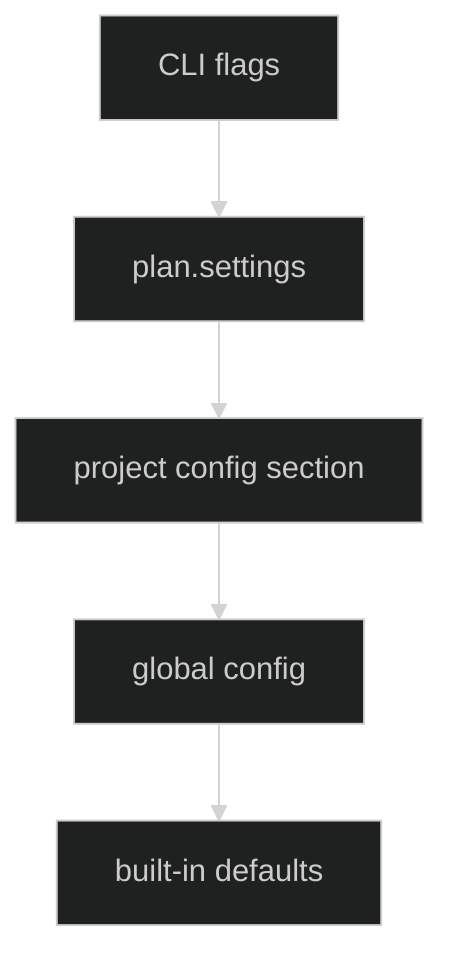

# Configuration

Praetor uses a layered configuration system based on a flat TOML file. Values are resolved through a three-level cascade:

```
defaults < global config < project section
```

## Config file location

The config file is resolved in this order:

1. `$PRAETOR_CONFIG` environment variable (if set)
2. `<praetor-home>/config.toml` (default: `~/.config/praetor/config.toml`)

```bash
# Check the resolved path
praetor config path
```

## CLI commands

```
praetor config
├── show          Show effective configuration (grouped, with source annotations)
├── set <k> <v>   Set a config key and persist to file
├── path          Print resolved config file path
├── edit          Open config file in $EDITOR
└── init          Create a commented template config file
```

### `config show`

Displays all config keys with their effective values and where each value came from.

```bash
praetor config show
praetor config show --workdir /path/to/project
praetor config show --no-color
```

Source annotations:

| Annotation | Meaning |
|---|---|
| `(default)` | Built-in default value |
| `(config)` | Set in the global section of the config file |
| `(project)` | Set in a `[projects."<path>"]` section |

Unset string values display as `-`.

### `config set`

Sets a config key and persists it to the config file. Values are validated against their expected type before writing.

```bash
praetor config set executor claude
praetor config set max-retries 5
praetor config set max-parallel-tasks 3
praetor config set plan-cost-budget-usd 15
praetor config set timeout 30m
praetor config set no-review true

# Write to a project section
praetor config set executor gemini --project /path/to/project
```

### `config path`

Prints the resolved config file path and exits.

```bash
praetor config path
```

### `config edit`

Opens the config file in `$VISUAL` or `$EDITOR`. Suggests `config init` if the file doesn't exist yet.

```bash
praetor config edit
```

### `config init`

Creates a commented template config file with all keys and their defaults. Refuses to overwrite an existing file unless `--force` is passed.

```bash
praetor config init
praetor config init --force
```

## File format

The config file uses a flat TOML-compatible format with optional project sections.

```toml
# Global settings (apply to all projects)
executor = "codex"
reviewer = "claude"
max-retries = 5
timeout = "30m"

# Project-specific overrides
[projects."/home/hugo/my-project"]
executor = "claude"
fallback-on-transient = "gemini"
hook = "./scripts/lint.sh"
```

Rules:

- One key per line, `key = value` syntax.
- Strings must be quoted (`"value"`), integers and booleans are bare (`5`, `true`).
- Durations use Go syntax (`"30m"`, `"2h"`, `"90s"`).
- Comments start with `#`.
- Project sections use `[projects."<absolute-path>"]` syntax.
- Unknown keys are rejected on load.
- Duplicate keys within a section are rejected.

## Configuration reference

### Agents

| Key | Type | Default | Description |
|---|---|---|---|
| `executor` | string | `codex` | Default executor agent: claude, codex, copilot, gemini, kimi, lmstudio, opencode, openrouter, or ollama |
| `reviewer` | string | `claude` | Default reviewer agent: claude, codex, copilot, gemini, kimi, lmstudio, opencode, openrouter, ollama, or none |
| `planner` | string | `claude` | Planner agent for macro-planning |

### Limits

| Key | Type | Default | Description |
|---|---|---|---|
| `max-retries` | int | `3` | Maximum retries per task (must be > 0) |
| `max-iterations` | int | `0` | Maximum loop iterations (0 = unlimited) |
| `max-transitions` | int | `0` | Maximum FSM state transitions (0 = unlimited) |
| `keep-last-runs` | int | `20` | Keep only the most recent N runs (0 = no pruning) |
| `max-parallel-tasks` | int | `1` | Maximum number of independent tasks to execute concurrently per wave |
| `timeout` | duration | `0s` | Run timeout (e.g. 30m, 2h); 0 = no timeout |
| `plan-cost-budget-usd` | float | `0` | Plan-level cost budget in USD (0 = disabled) |
| `task-cost-budget-usd` | float | `0` | Per-task cost budget in USD (0 = disabled) |
| `cost-budget-warn-threshold` | float | `0.8` | Emit warnings when cumulative cost reaches this fraction of the configured budget |
| `cost-budget-enforce` | bool | `true` | Stop execution when a configured cost budget is exceeded |

### Runtime

| Key | Type | Default | Description |
|---|---|---|---|
| `runner` | string | `tmux` | Runner mode: tmux, pty, or direct |
| `isolation` | string | `worktree` | Isolation mode: worktree or off |
| `no-review` | bool | `false` | Skip the reviewer gate and auto-approve executor outputs |
| `no-color` | bool | `false` | Disable colored output |
| `hook` | string | _(empty)_ | Script to run after executor, before reviewer |
| `gate-tests-cmd` | string | `go test ./...` | Host command for `tests` quality gate |
| `gate-lint-cmd` | string | `golangci-lint run` | Host command for `lint` quality gate |
| `gate-standards-cmd` | string | `go test ./... && golangci-lint run` | Host command for `standards` quality gate |

### Binaries

| Key | Type | Default | Description |
|---|---|---|---|
| `codex-bin` | string | `codex` | Codex binary path or name |
| `claude-bin` | string | `claude` | Claude binary path or name |
| `copilot-bin` | string | `copilot` | Copilot binary path or name |
| `gemini-bin` | string | `gemini` | Gemini CLI binary path or name |
| `kimi-bin` | string | `kimi` | Kimi binary path or name |
| `opencode-bin` | string | `opencode` | OpenCode binary path or name |

### REST

| Key | Type | Default | Description |
|---|---|---|---|
| `openrouter-url` | string | `https://openrouter.ai/api/v1` | OpenRouter base URL |
| `openrouter-model` | string | `openai/gpt-4o-mini` | Default OpenRouter model |
| `openrouter-api-key-env` | string | `OPENROUTER_API_KEY` | Environment variable containing OpenRouter API key |
| `ollama-url` | string | `http://127.0.0.1:11434` | Ollama base URL for REST requests |
| `ollama-model` | string | `llama3` | Default Ollama model |
| `lmstudio-url` | string | `http://localhost:1234` | LM Studio base URL for REST requests |
| `lmstudio-model` | string | _(empty)_ | Default LM Studio model |
| `lmstudio-api-key-env` | string | `LMSTUDIO_API_KEY` | Environment variable for LM Studio API key (optional) |

### Fallback

| Key | Type | Default | Description |
|---|---|---|---|
| `fallback` | string | _(empty)_ | Per-agent fallback (primary -> fallback) |
| `fallback-on-transient` | string | _(empty)_ | Global fallback agent for transient errors |
| `fallback-on-auth` | string | _(empty)_ | Global fallback agent for auth errors |

## Precedence

The effective runtime configuration follows this precedence (highest wins):

```
CLI flags > plan.settings > project config section > global config > defaults
```



This means:

1. Explicit CLI flags always win.
2. Plan-level settings (`settings.agents`, `settings.execution_policy`) override config-derived defaults for that specific plan.
3. Project section `[projects."<path>"]` overrides global config.
4. Global config section values are applied before plan loading.
5. Built-in defaults are the final fallback.

Implementation note:

- Config values are copied into command defaults before the plan is loaded.
- Only explicit CLI flags mark a field as "user set".
- As a result, `plan.settings` can override config values, but never explicit CLI flags.

## Example configurations

### Minimal

```toml
executor = "claude"
reviewer = "claude"
```

### Full setup with project overrides

```toml
# Global defaults
executor = "codex"
reviewer = "claude"
planner = "claude"
max-retries = 5
max-parallel-tasks = 2
timeout = "1h"
plan-cost-budget-usd = 20
task-cost-budget-usd = 3
cost-budget-warn-threshold = 0.75
runner = "tmux"
isolation = "worktree"

# Binary paths
codex-bin = "/usr/local/bin/codex"
claude-bin = "/usr/local/bin/claude"

# Fallback chain
fallback-on-transient = "gemini"
fallback-on-auth = "ollama"

# Host quality gates
gate-tests-cmd = "go test ./..."
gate-lint-cmd = "golangci-lint run"
gate-standards-cmd = "go test ./... && golangci-lint run"

# Ollama local setup
ollama-url = "http://127.0.0.1:11434"
ollama-model = "llama3"

# LM Studio local setup
lmstudio-url = "http://localhost:1234"

# Project: use Claude as executor, run lint after each task
[projects."/home/hugo/my-app"]
executor = "claude"
hook = "./scripts/lint.sh"
no-review = true
cost-budget-enforce = false

# Project: longer timeout for large refactors
[projects."/home/hugo/legacy-monolith"]
max-retries = 10
timeout = "3h"
```
