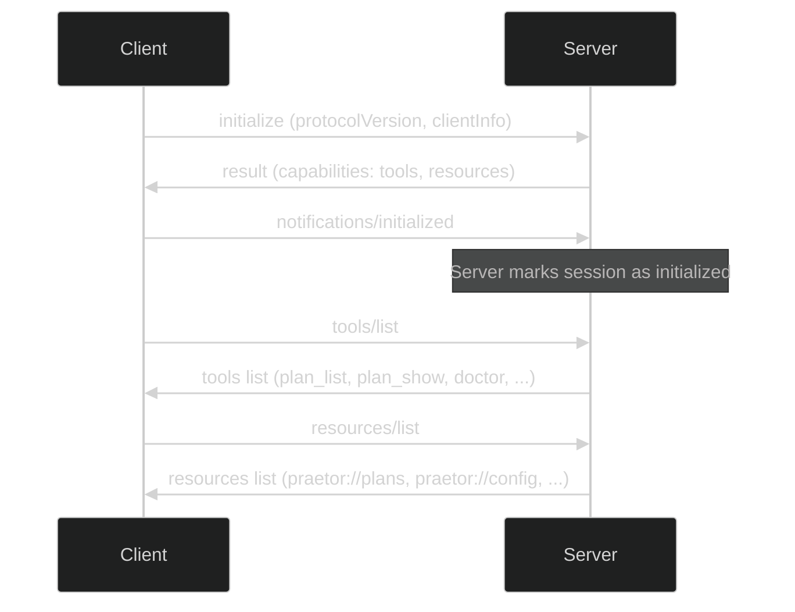
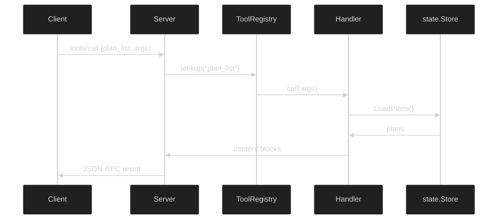
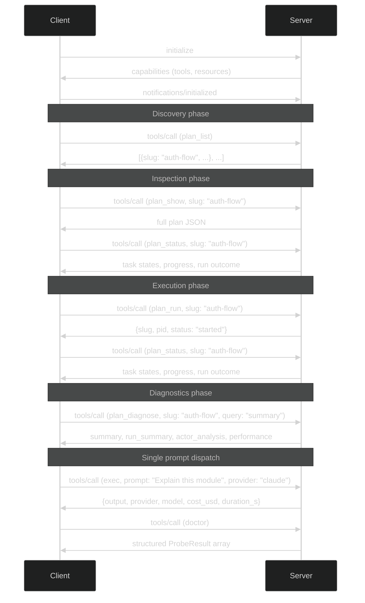
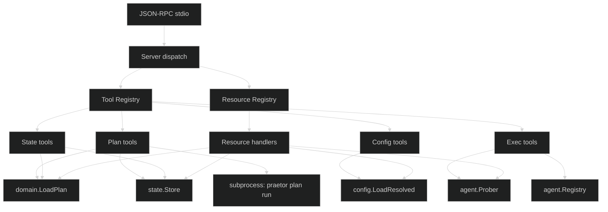

# MCP Server

Praetor includes a built-in [Model Context Protocol](https://modelcontextprotocol.io/) server, enabling any MCP-aware AI agent (Claude Code, Cursor, etc.) to interact with plans, state, and diagnostics programmatically.

## Quickstart

```bash
# 1. Install praetor
go install github.com/opus-domini/praetor/cmd/praetor@latest

# 2. Bootstrap MCP config (also sets up agent commands)
praetor init

# 3. Or manually add to your .mcp.json:
cat .mcp.json
```

After running `praetor init`, your `.mcp.json` will contain:

```json
{
  "mcpServers": {
    "praetor": {
      "command": "praetor",
      "args": ["mcp", "--project-dir", "/path/to/your/project"]
    }
  }
}
```

Verify the integration by asking your AI agent: _"list my praetor plans"_.

## Starting the server

```bash
praetor mcp [--project-dir <path>]
```

The server communicates over **stdio** using JSON-RPC 2.0 (one message per line). It is designed to be referenced in `.mcp.json`:

```json
{
  "mcpServers": {
    "praetor": {
      "command": "praetor",
      "args": ["mcp", "--project-dir", "/path/to/project"]
    }
  }
}
```

### MCP initialization handshake



## Tools

### Plan management

| Tool | Description | Required params |
|---|---|---|
| `plan_list` | List all plans for the current project | - |
| `plan_show` | Show a plan's full JSON content | `slug` |
| `plan_status` | Get detailed status for a plan | `slug` |
| `plan_create` | Create a new skeleton plan file | `name` |
| `plan_run` | Start plan execution in the background | `slug` |
| `plan_reset` | Reset a plan's runtime state | `slug` |

`plan_run` launches the orchestration pipeline as a background subprocess and returns immediately with the process PID. It defaults to `--runner direct` for non-interactive use. Optional parameters: `executor`, `reviewer`, `runner`, `no_review`. Monitor progress with `plan_status` and `plan_events`.

### State and diagnostics

| Tool | Description | Required params |
|---|---|---|
| `plan_events` | Get execution events from a plan run | `slug` |
| `plan_diagnose` | Get diagnostics, summary, actor analysis, and performance for the latest run | `slug` |

The `plan_diagnose` tool accepts a `query` parameter: `errors`, `stalls`, `fallbacks`, `costs`, `summary`, or `all` (default). Note: the `regressions` query available in the CLI is not supported via MCP.

The response includes:

- `summary`: plan status plus effective cost budget limits
- `run_summary`: latest persisted run summary with retries, stalls, fallbacks, and totals
- `actor_analysis`: per-actor cost plus the noisiest retry/stall actors
- `events`: filtered `events.jsonl` records for the selected query
- `performance`: prompt/performance diagnostics when available

### Configuration

| Tool | Description | Required params |
|---|---|---|
| `config_show` | Show resolved configuration | - |
| `config_set` | Set a configuration value | `key`, `value` |

### Execution

| Tool | Description | Required params |
|---|---|---|
| `doctor` | Check availability of all AI agent providers | - |
| `exec` | Run a single prompt against an agent provider | `prompt` |

`doctor` returns one `ProbeResult` per provider with `status`, `transport`, `version`, `path`, `detail`, and `checks[]` entries that include remediation hints when available. It respects config overrides for binary paths and REST endpoints.

`exec` dispatches a prompt to any provider and returns structured output including the response text, model used, cost, and duration. Optional parameters: `provider` (default: codex), `model`. Config overrides for binary paths, REST endpoints, and API keys are loaded automatically.

### Tool call dispatch



## Resources

The server also exposes MCP resources for passive data access:

| URI | Description |
|---|---|
| `praetor://plans` | List of all plans |
| `praetor://plans/{slug}` | Full plan JSON |
| `praetor://plans/{slug}/state` | Current execution state |
| `praetor://config` | Resolved configuration |
| `praetor://agents` | Agent health status |

## Example interaction

```json
{"jsonrpc":"2.0","id":1,"method":"initialize","params":{"protocolVersion":"2024-11-05","capabilities":{},"clientInfo":{"name":"claude-code","version":"1.0"}}}
{"jsonrpc":"2.0","id":2,"method":"tools/call","params":{"name":"plan_list","arguments":{}}}
{"jsonrpc":"2.0","id":3,"method":"tools/call","params":{"name":"doctor","arguments":{}}}
{"jsonrpc":"2.0","id":4,"method":"tools/call","params":{"name":"exec","arguments":{"prompt":"Explain this module","provider":"claude"}}}
{"jsonrpc":"2.0","id":5,"method":"tools/call","params":{"name":"plan_run","arguments":{"slug":"auth-flow","executor":"claude"}}}
{"jsonrpc":"2.0","id":6,"method":"resources/read","params":{"uri":"praetor://config"}}
```

### Typical session flow



## Implementation

The MCP server is implemented in `internal/mcp/` using only Go stdlib:

- `server.go` — JSON-RPC 2.0 stdio loop and MCP dispatch
- `protocol.go` — MCP protocol types
- `tools.go` — Tool registry and helpers
- `tools_plan.go` — Plan management tools
- `tools_state.go` — State and diagnostics tools
- `tools_config.go` — Configuration tools
- `tools_exec.go` — Execution tools (doctor, exec)
- `resources.go` — MCP resource definitions

### Component architecture



All tool handlers reuse existing praetor packages (`state.Store`, `domain.LoadPlan`, `config.LoadResolved`, etc.) ensuring consistent behavior with the CLI.
