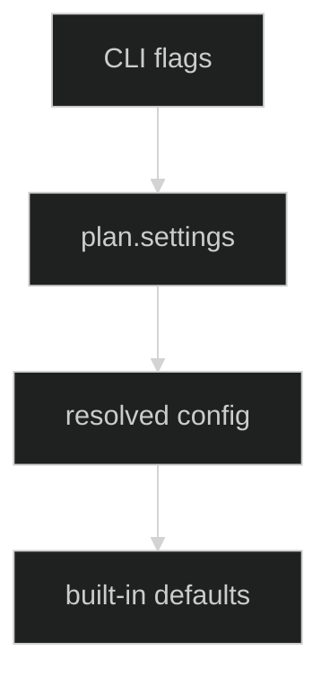
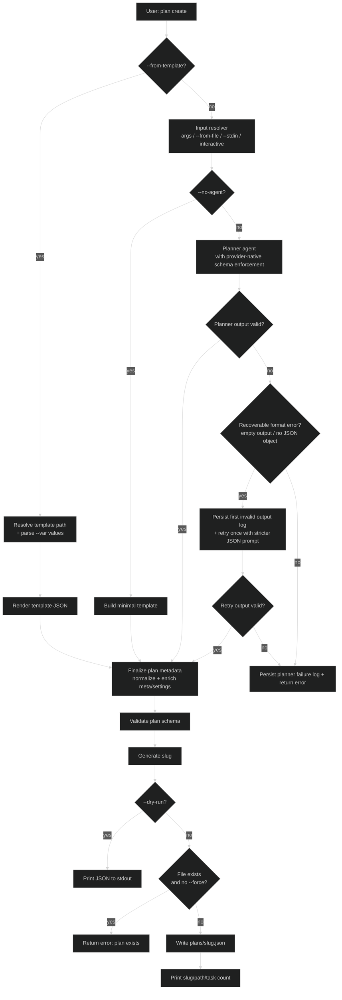
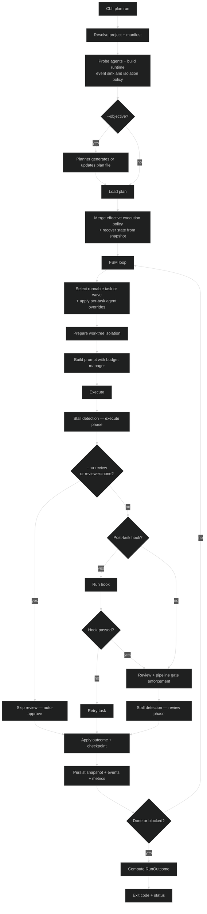
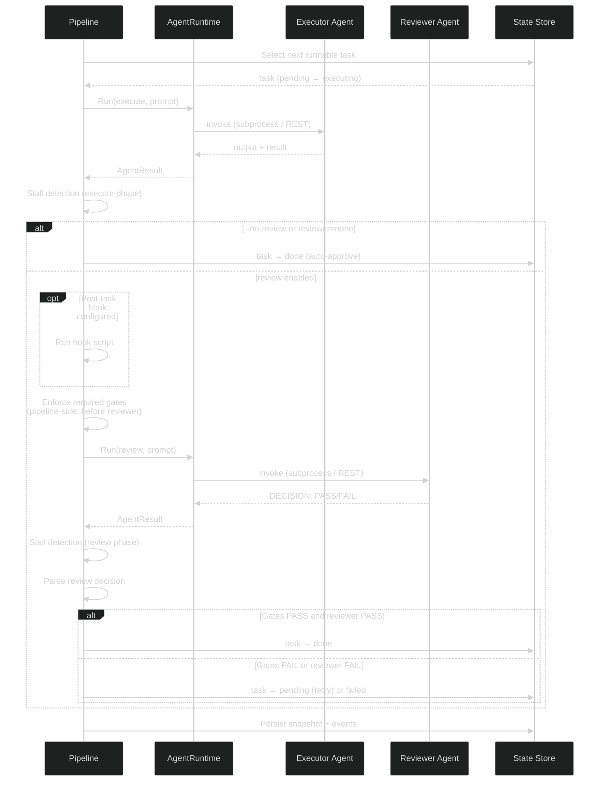
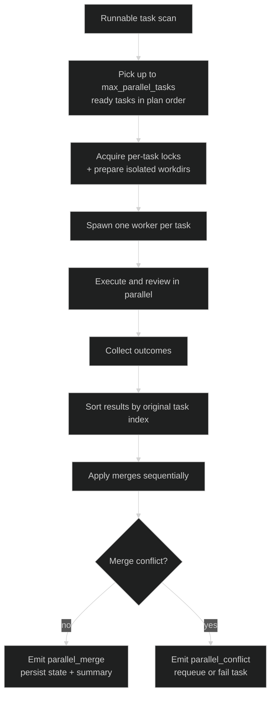
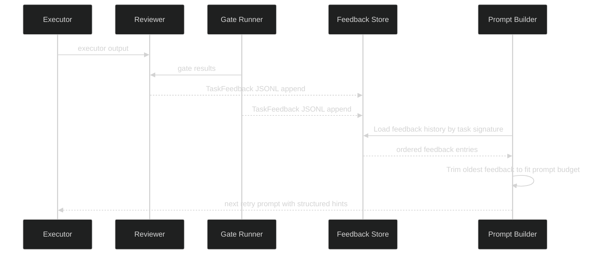
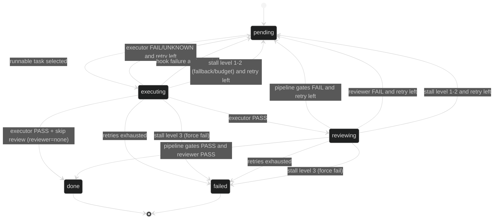
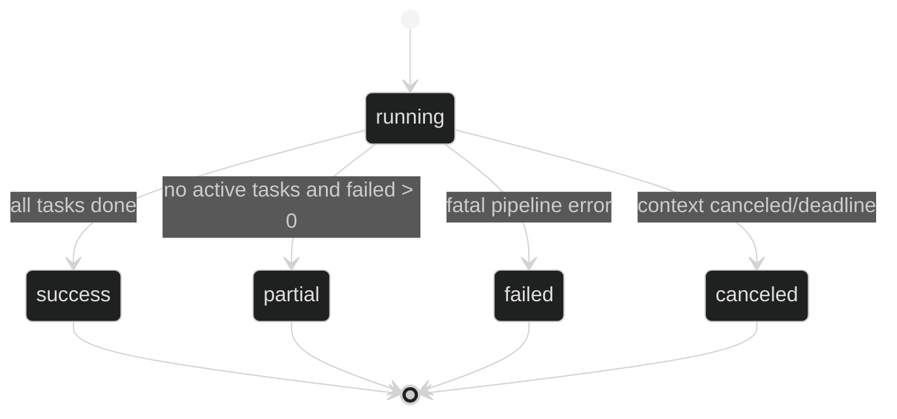
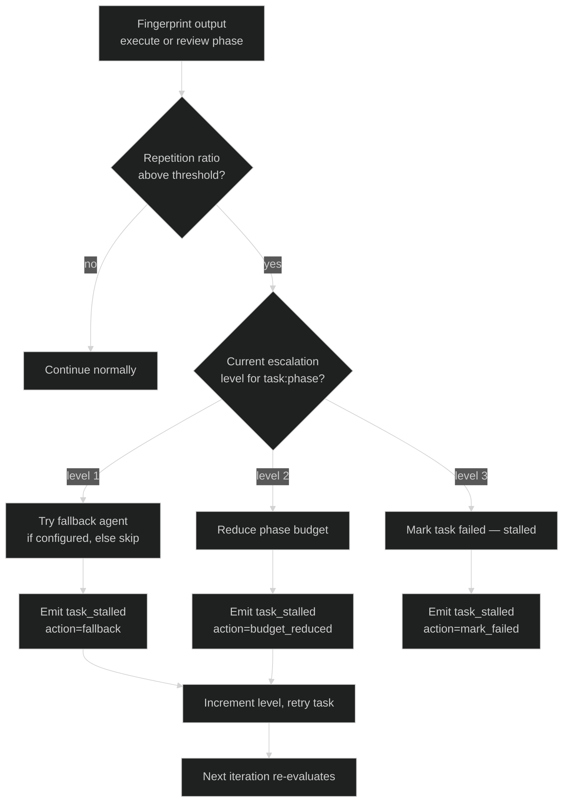
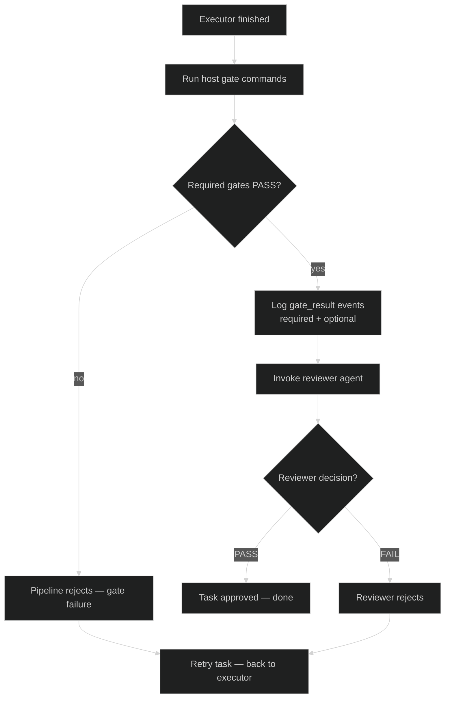

# Task orchestration

Praetor orchestrates plans with a strict JSON schema and a Plan -> Execute -> Review loop.

## CLI workflows

### Create a plan (agent-assisted)

```bash
praetor plan create "Implement user authentication with JWT and tests"
praetor plan create --from-file docs/brief.md
cat brief.md | praetor plan create --stdin
praetor plan create --from-template feature --var Name="JWT auth" --var Summary="Implement JWT auth"
```

Useful flags:

- `--planner <agent>` and `--planner-model <model>`: override planner defaults.
- `--planner-timeout <duration>`: cap total planner generation time (e.g. `5m`, `12m`); `0` disables timeout.
- `--slug <slug>`: force a specific slug.
- `--dry-run`: print generated JSON without writing a file.
- `--no-agent`: generate a minimal valid template without calling a planner.
- `--from-template <name>` and `--var key=value`: render a reusable plan template from project, global, or builtin registries.
  Builtin templates are software-engineering oriented: `feature`, `bug-fix`, `refactor`, `discovery`, `implementation`, `validation`, and `release`.
- `--force`: overwrite an existing plan file.

### Export a plan bundle

```bash
praetor plan export my-plan
praetor plan export my-plan --output ./exports/my-plan
```

The export bundle contains `plan.json`, `summary.json`, `template.json`, and `state.json` when runtime state exists.

### Run a plan

```bash
praetor plan run my-plan \
  --runner direct \
  --executor codex \
  --reviewer claude \
  --executor-model gpt-5-codex \
  --reviewer-model opus \
  --executor-prompt-chars 120000 \
  --reviewer-prompt-chars 80000 \
  --plan-cost-budget-usd 5 \
  --task-cost-budget-usd 1 \
  --max-parallel-tasks 2 \
  --stall-enabled \
  --stall-window 3 \
  --stall-threshold 0.67
```

### Diagnose a run

```bash
praetor plan diagnose my-plan --query errors
praetor plan diagnose my-plan --query stalls --format json
praetor plan diagnose my-plan --query costs
```

Allowed queries: `errors`, `stalls`, `fallbacks`, `costs`, `summary`, `regressions`, `all`.

### Evaluate local execution quality

```bash
# Plan-level quality evaluation (latest run)
praetor plan eval my-plan

# Plan-level quality evaluation for one specific run
praetor plan eval my-plan --run-id run-123 --format json

# Project-level aggregation (latest run per plan, last 7 days by default)
praetor eval

# Project-level aggregation with explicit window and JSON output
praetor eval --window 168h --format json
```

`praetor plan eval` inspects the complete local flow for the selected run:

- task acceptance (`done` + quality evidence)
- required gate outcomes (`tests`, `lint`, `standards`, or plan-defined gates)
- parser/contract failures (`executor_parse_error`, `reviewer_parse_error`)
- stalls, retries, cost, and duration

`praetor eval` aggregates plan-level results for the project and emits a global verdict (`pass|warn|fail`).

## Plan schema

Canonical schema file: [`docs/schemas/plan.schema.json`](schemas/plan.schema.json)

```json
{
  "name": "Implementar autenticação de usuários",
  "summary": "Adicionar fluxo de login seguro com testes e documentação mínima.",
  "meta": {
    "source": "agent",
    "created_at": "2026-02-27T10:30:00Z",
    "created_by": "hugo",
    "generator": {
      "name": "praetor",
      "version": "0.15.0",
      "prompt_hash": "sha256:4d2f..."
    }
  },
  "cognitive": {
    "assumptions": ["API is REST, not GraphQL"],
    "open_questions": ["Auth method TBD"],
    "failure_modes": ["If DB migration fails, rollback via snapshot"],
    "decisions": ["Use interfaces for all agent interactions"]
  },
  "settings": {
    "agents": {
      "planner": {
        "agent": "claude",
        "model": "opus"
      },
      "executor": {
        "agent": "codex",
        "model": "gpt-5-codex"
      },
      "reviewer": {
        "agent": "claude",
        "model": "opus"
      }
    },
    "execution_policy": {
      "max_total_iterations": 200,
      "max_retries_per_task": 3,
      "max_parallel_tasks": 2,
      "timeout": "1h",
      "prompt_budget": {
        "executor_chars": 120000,
        "reviewer_chars": 80000
      },
      "cost": {
        "plan_limit_cents": 500,
        "task_limit_cents": 100,
        "warn_threshold": 0.8,
        "enforce": true
      },
      "stall_detection": {
        "enabled": false,
        "window": 3,
        "threshold": 0.67
      }
    }
  },
  "quality": {
    "evidence_format": "gates_v1",
    "required": ["tests", "lint"],
    "optional": ["coverage>=80"],
    "commands": {
      "tests": "go test ./...",
      "lint": "golangci-lint run",
      "standards": "go test ./... && golangci-lint run"
    }
  },
  "tasks": [
    {
      "id": "TASK-001",
      "title": "Criar módulo de autenticação",
      "description": "Implementar hash e verificação de senha com bcrypt",
      "acceptance": [
        "Todos os testes da camada auth passando",
        "Senha nunca é persistida em texto puro"
      ],
      "depends_on": []
    }
  ]
}
```

### Required fields

- `name`
- `settings.agents.executor.agent`
- `settings.agents.reviewer.agent`
- `tasks` (non-empty)
- `tasks[].id` (unique, non-empty)
- `tasks[].title` (non-empty)
- `tasks[].acceptance` (non-empty array)

### Cognitive metadata

```json
{
  "cognitive": {
    "assumptions": ["API is REST, not GraphQL"],
    "open_questions": ["Auth method TBD"],
    "failure_modes": ["If DB migration fails, rollback via snapshot"],
    "decisions": ["Use interfaces for all agent interactions"]
  }
}
```

### Per-task tool constraints

```json
{
  "tasks": [{
    "id": "TASK-001",
    "title": "Refactor auth module",
    "acceptance": ["Tests pass"],
    "constraints": {
      "allowed_tools": ["read", "edit", "bash:test"],
      "denied_tools": ["bash:rm", "bash:git push"],
      "timeout": "30m"
    }
  }]
}
```

When `allowed_tools` is set, the executor system prompt includes a `TOOL CONSTRAINTS` block restricting which tools the agent may use. When `denied_tools` is set, the executor is instructed not to use those tools. The `timeout` field overrides the plan-level timeout for that specific task.

### Per-task agent override

```json
{
  "tasks": [{
    "id": "TASK-001",
    "title": "Complex refactoring",
    "acceptance": ["Tests pass"],
    "agents": {
      "executor": "claude",
      "reviewer": "none",
      "executor_model": "opus",
      "reviewer_model": ""
    }
  }]
}
```

When a task declares `agents.executor`, it overrides the plan-level executor for that task only. Same for `agents.reviewer` and their respective models. This enables mixed-agent strategies like "use Claude for refactoring, Codex for code generation".

### Standards gate

When `"standards"` is included in `quality.required`, the reviewer system prompt is enhanced with instructions to validate changes against project conventions (file placement, naming patterns, architecture rules). The reviewer will FAIL tasks that are functionally correct but violate project conventions.

```json
{
  "quality": {
    "required": ["tests", "lint", "standards"]
  }
}
```

## Configuration precedence

The effective runtime configuration is resolved in this order (highest wins):

1. Explicit CLI flags
2. `plan.settings` (`agents` + `execution_policy`)
3. Resolved Praetor config (`$PRAETOR_CONFIG` or `<praetor-home>/config.toml`, including project section)
4. Built-in defaults

Config values are applied to flag variables before plan loading. Only explicit CLI flags mark a field as user-set, so plan settings can override config-derived defaults but never explicit CLI overrides.



## `plan create` flow



Praetor enforces provider-native structured planner output when the adapter supports it, currently `claude --json-schema` and `codex exec --output-schema`. Recoverable planner format errors are retried once with a stricter recovery prompt. If `--planner-timeout` is set, the timeout applies to the whole planner session, including the retry.

## `plan run` flow



### Execute → Review iteration



### Parallel wave execution

When `max_parallel_tasks > 1`, the runner executes a dependency-ready wave concurrently, but still applies state transitions and merges in a single deterministic order.



The merge phase is intentionally single-writer. This avoids races in `state.json`, checkpoint history, cost accumulation, and summary aggregation.

### Structured feedback retry loop

Reviewer and gate failures generate structured `TaskFeedback` entries that are persisted per task signature and reloaded on the next executor attempt.



Feedback is stored under `feedback/<slug>/<task-signature>.jsonl`, sorted by `attempt` and `timestamp`, and truncated from the oldest entries first when the prompt budget is exceeded.

## Task state machine (with stall guard)



## Run outcome and exit codes

Run outcome is persisted in state and snapshots.



| Exit code | Outcome | Meaning |
|---|---|---|
| `0` | `success` | all tasks completed |
| `1` | `failed` | fatal pipeline failure |
| `2` | `canceled` | canceled by signal/context/timeout |
| `3` | `partial` | mix of `done` and `failed` tasks |

## Prompt budget manager

`ContextBudgetManager` keeps prompts bounded per phase.

Default budgets:

- Execute: `120000` chars
- Review: `80000` chars

Token estimate heuristic:

- `estimated_tokens = len(prompt) / 4`

Behavior:

- Execute phase truncates retry feedback first.
- Review phase truncates `executor_output` first, then `git_diff`.
- Performance metrics are appended to `runtime/<run-id>/diagnostics/performance.jsonl`.
- Truncation emits `prompt_budget_warning` events.

## Stall detection

When enabled, stall detection fingerprints normalized outputs per `task+phase` with a sliding window. Stall detection runs after **both** the execute and review phases.

Normalization removes high-variance noise:

- timestamps
- UUIDs
- absolute paths
- extra whitespace

The fingerprint is a SHA256 hash of the normalized output. A stall is detected when the repetition ratio (identical fingerprints / window size) exceeds the threshold.

Escalation uses a **persistent counter per `taskID:phase`** across iterations. Each stall detection increments the counter and fires the action for the current level. A `task_stalled` event is emitted at every level.

Escalation policy:

1. try fallback agent (if configured)
2. reduce phase budget
3. mark task as failed (`stalled`)



## Backpressure via quality gates

`quality.required` enforces completion through **host-executed** gate commands.

Default gate commands:

- `tests` -> `go test ./...`
- `lint` -> `golangci-lint run`
- `standards` -> `go test ./... && golangci-lint run`

Overrides are supported in two places:

- config keys: `gate-tests-cmd`, `gate-lint-cmd`, `gate-standards-cmd`
- plan quality overrides: `quality.commands.tests|lint|standards`

Executor-reported `GATES:` evidence remains auxiliary fallback when a host gate command is missing.

Executor evidence format (auxiliary fallback):

```text
GATES:
- tests: PASS (42 tests passed, 0 failed)
- lint: PASS (no issues found)
```

Rules:

- Required host gate `FAIL|ERROR|MISSING` => review rejection.
- Optional gate failures are logged (`gate_result`) but do not block completion.
- Reviewer PASS/FAIL is still evaluated independently after host gates pass.



## Diagnostics and observability

Run artifacts:

- `runtime/<run-id>/events.jsonl`
- `runtime/<run-id>/diagnostics/performance.jsonl`
- `runtime/<run-id>/snapshot.json`

Event schema (v1):

```json
{
  "schema_version": 1,
  "type": "agent_start",
  "event_type": "agent_start",
  "timestamp": "2026-02-27T10:30:00Z",
  "run_id": "20260227-...",
  "task_id": "TASK-001",
  "phase": "execute",
  "role": "executor",
  "agent": "codex",
  "actor": {
    "role": "executor",
    "agent": "codex",
    "model": "gpt-5-codex"
  },
  "data": {}
}
```

Supported event types:

- `agent_start`
- `agent_complete`
- `agent_error`
- `agent_fallback`
- `task_started`
- `task_completed`
- `task_failed`
- `task_stalled`
- `prompt_budget_warning`
- `cost_budget_warning`
- `cost_budget_exceeded`
- `gate_result`
- `parallel_merge`
- `parallel_conflict`
- `state_transition`

`plan diagnose` reads these files and supports `errors`, `stalls`, `fallbacks`, `costs`, `summary`, `regressions`, and `all`. Run summaries also persist actor-level totals for cost, calls, retries, stalls, and time spent.
