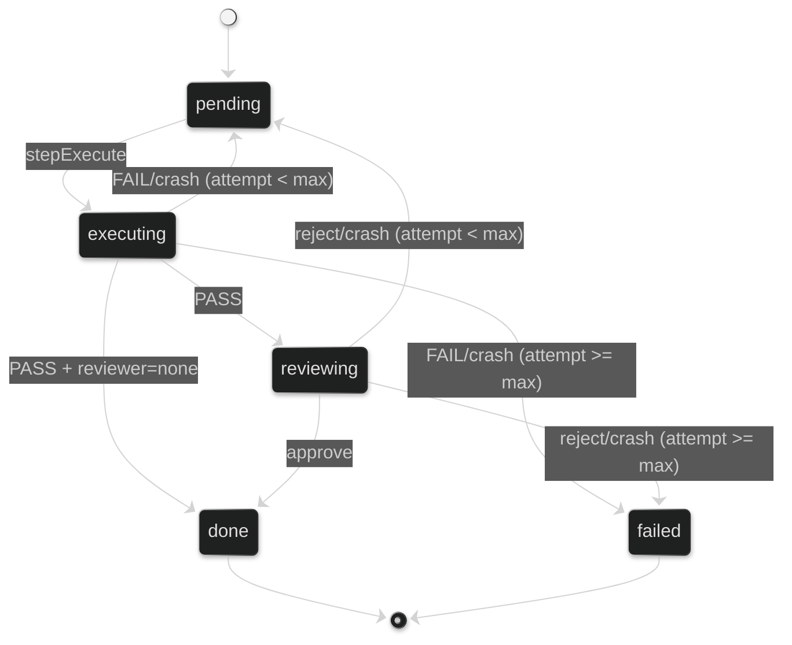

# Task orchestration

Praetor's core is plan-driven task orchestration. Define a sequence of tasks in a JSON plan, then execute it with `praetor plan run`. Each task goes through an executor agent, an optional post-task hook, and a reviewer agent before being marked as done.

## Commands

### Create a plan

```bash
praetor plan create my-feature
```

Creates a skeleton plan at `<project-home>/plans/my-feature.json` and opens `$EDITOR`.

### Run a plan

```bash
praetor plan run my-plan
```

### Run with options

```bash
praetor plan run my-plan \
  --runner direct \
  --executor codex \
  --reviewer claude \
  --max-retries 5 \
  --max-transitions 200 \
  --keep-last-runs 20 \
  --hook ./scripts/validate.sh \
  --fallback-on-transient ollama \
  --timeout 2h
```

### Check progress

```bash
praetor plan status my-plan
```

Output:

```
Plan:     my-plan
State:    ~/.config/praetor/projects/my-project-abc123/state/my-plan.state.json
Updated:  2026-02-25T14:30:00Z
Progress: 3/5 tasks done
Status:   in progress

  [x] TASK-001: Implement feature
  [x] TASK-002: Add tests
  [x] TASK-003: Update docs
  [ ] TASK-004: Integration tests
  [!] TASK-005: Final review (failed, attempt 3)
```

Status markers: `[x]` done, `[ ]` pending, `[>]` executing/reviewing, `[!]` failed.

### List all tracked plans

```bash
praetor plan list
```

### Reset plan state

```bash
praetor plan reset my-plan
```

Removes state, lock, retry, and feedback files for the plan. Does not delete the plan file itself.

### Resume from local snapshot

```bash
praetor plan resume my-plan
```

Restores the latest valid local snapshot from `<project-home>/runtime/<run-id>/snapshot.json` into project state storage.

## Plan format

Plans are JSON files with a `tasks` array. Each task can specify its own executor, reviewer, and model:

```json
{
  "title": "implement user auth",
  "tasks": [
    {
      "id": "TASK-001",
      "title": "Add password hashing",
      "executor": "codex",
      "reviewer": "claude",
      "model": "sonnet",
      "description": "Implement bcrypt password hashing in pkg/auth.",
      "criteria": "All existing tests pass. New tests cover hash and verify."
    },
    {
      "id": "TASK-002",
      "title": "Add login endpoint",
      "depends_on": ["TASK-001"],
      "executor": "codex",
      "reviewer": "claude",
      "description": "Add POST /login endpoint using the auth package.",
      "criteria": "Endpoint returns 200 with valid credentials, 401 otherwise."
    }
  ]
}
```

### Task fields

| Field | Required | Description |
|-------|----------|-------------|
| `id` | no | Unique task identifier. Auto-generated as `auto-<index>` if omitted. |
| `title` | yes | Short task description. |
| `depends_on` | no | Array of task IDs that must complete before this task runs. |
| `executor` | no | Agent for execution: `claude`, `codex`, `copilot`, `gemini`, `kimi`, `opencode`, `openrouter`, or `ollama`. Falls back to `--executor`. |
| `reviewer` | no | Agent for review: `claude`, `codex`, `copilot`, `gemini`, `kimi`, `opencode`, `openrouter`, `ollama`, or `none`. Falls back to `--reviewer`. |
| `model` | no | Model hint: `sonnet`, `opus`, or `haiku`. |
| `description` | no | Detailed task description included in the executor prompt. |
| `criteria` | no | Acceptance criteria included in both executor and reviewer prompts. |

### Validation rules

The plan is validated at load time:

- `tasks` array cannot be empty.
- Every task must have a non-empty `title`.
- Task IDs must be unique.
- `depends_on` must reference existing task IDs.
- `executor` must be one of the 8 supported agents: `claude`, `codex`, `copilot`, `gemini`, `kimi`, `opencode`, `openrouter`, or `ollama` (if specified).
- `reviewer` must be one of the 8 supported agents or `none` (if specified).
- `model` must be `sonnet`, `opus`, or `haiku` (if specified).

## Runtime model

### Data layout

All Praetor data lives under a single home directory. Resolution order: `$PRAETOR_HOME` > `$XDG_CONFIG_HOME/praetor` > `~/.config/praetor`.

```text
~/.config/praetor/                       # $PRAETOR_HOME
├── config.toml
└── projects/
    └── <project-key>/                   # e.g. "my-project-a3f9c12b4d8e"
        ├── plans/                       # Plan JSON files
        │   └── my-feature.json
        ├── state/                       # Task state per plan (.state.json)
        ├── locks/                       # PID-based run locks
        ├── retries/                     # Retry counters (absorbed into state file on load)
        ├── feedback/                    # Feedback files (absorbed into state file on load)
        ├── costs/                       # Cost tracking ledger (tracking.tsv)
        ├── checkpoints/                 # Audit log (history.tsv) and current state (.state)
        ├── logs/                        # Per-run execution logs (purgeable)
        │   └── <timestamp>-<task>-<sig>/
        │       ├── executor.system.txt
        │       ├── executor.prompt.txt
        │       ├── executor.output.txt
        │       ├── executor.prompt          # Raw prompt file (tmux mode)
        │       ├── executor.system-prompt   # Raw system prompt file (tmux mode)
        │       ├── executor.stdout          # Raw stdout capture (tmux mode)
        │       ├── executor.stderr          # Raw stderr capture (tmux mode)
        │       ├── executor.exit            # Exit code (tmux mode)
        │       ├── executor.run.sh          # Wrapper script (tmux mode)
        │       ├── reviewer.*               # Same structure for reviewer
        │       ├── post-hook.stdout         # Post-task hook stdout (if used)
        │       └── post-hook.stderr         # Post-task hook stderr (if used)
        ├── runtime/                     # Transactional snapshots
        │   └── <run-id>/
        │       ├── snapshot.json
        │       ├── events.log
        │       ├── events.jsonl           # Structured execution events (JSONL)
        │       ├── lock.json
        │       └── meta.json
        └── worktrees/                   # Git worktrees for isolation
            └── <task-id>--<token>/
```

The project key is derived from the git repository name and a truncated path hash, ensuring state isolation between projects. No files are generated inside the user's repository.

`meta.json` stores `snapshot_sha256`, which is validated during recovery to skip corrupted snapshots.

### Task state machine

Each task follows an explicit finite state machine with five states and validated transitions. The design adapts Rob Pike's function-as-state pattern for persistence: each state maps to a step function that does its work and returns the next `TaskStatus` to persist.

#### States

| Status | Description | Terminal |
|--------|-------------|----------|
| `pending` | Ready to execute (or awaiting retry). | no |
| `executing` | Executor agent is running. | no |
| `reviewing` | Reviewer agent is evaluating the result. | no |
| `done` | Task completed and merged successfully. | yes |
| `failed` | All retry attempts exhausted. | yes |

#### State diagram



Tasks with `reviewer = none` skip the `reviewing` state: `executing` transitions directly to `done` on success.

#### Transition table

Every state change is validated against a declarative transition table. Invalid transitions return an error immediately.

```go
var validTransitions = map[TaskStatus][]TaskStatus{
    TaskPending:   {TaskExecuting, TaskFailed},
    TaskExecuting: {TaskReviewing, TaskDone, TaskPending, TaskFailed},
    TaskReviewing: {TaskDone, TaskPending, TaskFailed},
    TaskDone:      {},  // terminal
    TaskFailed:    {},  // terminal
}
```

#### Step functions

| Step | Trigger | Outcomes |
|------|---------|----------|
| **stepExecute** | Task is `pending` | `executing` → run executor → PASS: `reviewing` (or `done` if no reviewer) / FAIL: `pending` (retry) / crash: `pending` (retry) |
| **stepReview** | Task is `reviewing` | Run reviewer → PASS: `done` / FAIL: `pending` (retry) / crash: `pending` (retry) |
| **retryGuard** | Before each step | If `attempt >= maxRetries`: `pending` → `failed` |

#### Crash recovery

On state file load, transient states are reset for crash safety:

- `executing` → `pending` (executor was interrupted)
- `reviewing` → `pending` (reviewer was interrupted)

This is safe because no partial work is committed to the main branch until a task reaches `done`.

#### Status normalization

On load, any unrecognized status value defaults to `"pending"`. Retry counts from external files (`retries/*.count`) are absorbed into `StateTask.Attempt`. The state file is the single source of truth.

#### StateTask fields

```go
type StateTask struct {
    // ... plan fields (ID, Title, DependsOn, etc.) ...
    Status   TaskStatus `json:"status"`              // current state
    Attempt  int        `json:"attempt,omitempty"`    // retry count (0 = never tried)
    Feedback string     `json:"feedback,omitempty"`   // last failure feedback
}
```

`Attempt` and `Feedback` are embedded in the state file — no external retry/feedback files are needed in the hot path.

### Dependency resolution

Tasks are selected in order. A task is runnable when:

1. Its status is `pending`.
2. All tasks in its `depends_on` list have status `done`.

The runner picks the first runnable task. If no task is runnable and active (non-terminal) tasks remain, the plan is blocked.

### Locking

Each plan run acquires a PID-based lock file. If the lock holder process is still alive, a new run is rejected unless `--force` is used. Locks are released on exit.

### Retry mechanism

Each task carries its retry state in `StateTask.Attempt` and `StateTask.Feedback`. On failure:

1. `Attempt` increments and `Feedback` stores the failure reason (crash message, reviewer rejection, hook output).
2. The task transitions back to `pending` via a validated state transition.
3. On the next attempt, the feedback is injected into the executor prompt with emphatic formatting.
4. Before each step, a retry guard checks `Attempt >= maxRetries`. If exhausted, the task transitions to `failed` (terminal).

`Attempt` and `Feedback` are cleared when a task completes successfully. They persist across process restarts as part of the state file.

## Project context (`praetor.yaml` / `praetor.md`)

At run start, Praetor resolves context from repository root in this order:

1. `praetor.yaml`
2. `praetor.yml`
3. `praetor.md`

When YAML follows the lightweight schema below, content is normalized before injection:

```yaml
version: "1"
instructions:
  - keep public API stable
constraints:
  - do not modify infra manifests
test_commands:
  - go test ./...
```

Unknown YAML keys fall back to raw fenced YAML. Normalized context is injected into planner/executor/reviewer prompts.

Use project context for:

- Coding conventions and style guidelines
- Architecture constraints agents must respect
- Testing requirements and CI expectations
- Technology-specific instructions

Manifest content is limited to 16 KiB. If it exceeds this limit, content is truncated with a warning.

## Safety mechanisms

### Worktree isolation

Enabled by default (`--isolation worktree`). Before each executor run:

1. A dedicated `git worktree` is created on a new branch (`praetor/<task>--<runID>`).
2. The executor and reviewer agents operate inside the worktree, never touching the main working tree.
3. On success: uncommitted changes are auto-committed, the branch is merged into main, and the worktree is removed.
4. On any failure (executor crash, self-reported FAIL, hook failure, reviewer rejection): the worktree and branch are deleted without merging — the main tree stays untouched.

Disable with `--isolation off` for non-git workspaces. Orphan worktree metadata from previous crashes is pruned automatically at startup via `git worktree prune`.

### Post-task hook

A custom script (`--hook <path>`) runs between the executor and reviewer phases:

- The hook runs with the workdir as CWD.
- Exit code 0: proceed to reviewer.
- Exit code non-zero: increment retry, store last 50 lines of stdout as feedback, discard the worktree.
- Stdout/stderr are saved to `<runDir>/post-hook.stdout` and `post-hook.stderr`.

Use this for linters, type checkers, or integration tests that must pass before review.

### Pre-flight checks

Before the run starts, all required prerequisites are validated:

- **CLI agents** (`claude`, `codex`, `copilot`, `gemini`, `kimi`, `opencode`): validated with `exec.LookPath` against the configured binary name.
- **REST agents** (`openrouter`): validates that the API key environment variable is set.
- **`tmux`**: required only in `--runner tmux` mode.

Missing binaries or unset API keys produce a clear error listing all that are absent. Use `praetor doctor` to check agent availability independently.

## Observability

### Cost tracking

Every agent invocation records a cost entry to `costs/tracking.tsv`:

```
timestamp	run_id	task_id	agent	role	duration_s	status	cost_usd
2026-02-25T14:30:00Z	20260225-143000-TASK-001-abc12345	TASK-001	codex	executor	45.20	pass	0.032100
```

Cost is extracted from:
- **Claude**: `ResultMessage.TotalCostUSD` from the stream-json protocol.
- **Codex**: `total_cost_usd` from `--json` output (tmux mode).

The run summary displays accumulated cost:

```
Run summary  done=5 rejected=1 iterations=6 cost=$0.2341 duration=2m15s
```

### Checkpoint audit log

Every state transition appends to `checkpoints/history.tsv`:

```
timestamp	status	task_id	signature	run_id	message
```

Tracked transitions include `completed`, `executor_crashed`, `hook_failed`, `reviewer_crashed`, `review_rejected`, `blocked`, and `runtime_strategy`.

The current checkpoint is also written as a key-value file at `checkpoints/<plan>.state`.

### Terminal output

Colored, structured output shows real-time progress:

```
=== Praetor ===
Plan:        implement user auth
Plan:        user-auth
State:       ~/.config/praetor/projects/my-project-abc123/state/user-auth.state.json
Progress:    0/2 done
Isolation:   worktree
tmux:        praetor-abc123

[1/2] TASK-001 Add password hashing
  executor (codex) attempt 1/3 [45.2s]
  hook     (post-task) ./scripts/validate.sh
  reviewer (claude) review complete [12.1s]
  [ok] Completed: TASK-001

[2/2] TASK-002 Add login endpoint
  executor (codex) attempt 1/3 [38.7s]
  reviewer (claude) review complete [8.3s]
  [ok] Completed: TASK-002

Run summary  done=2 rejected=0 iterations=2 cost=$0.0891 duration=1m44s
```

Disable colors with `--no-color` or the `NO_COLOR` environment variable.

## Tmux execution

Every agent invocation runs in a dedicated tmux window:

1. A wrapper shell script is generated with the agent command, I/O redirection, and a `tmux wait-for` signal.
2. The script is launched in a new tmux window named `praetor-<task>-<role>`.
3. The runner blocks on `tmux wait-for <channel>` until the script completes.
4. Exit code, stdout, and stderr are read from files.

The tmux session is auto-created if it doesn't exist and auto-destroyed on clean exit (only if praetor created it). Attach to the session to watch agents work in real time:

```bash
tmux attach -t praetor-<project-hash>
```

## Execution strategy

Each agent invocation records the effective execution strategy:

- `structured` for native structured transports (for example REST/Ollama)
- `process` for regular subprocess execution
- `pty` for interactive terminal execution

In `--runner direct`, CLI execution prefers `process` and falls back to `pty` when TTY-related failures are detected.

## Fallback and resilience

### Error classification

When an agent fails, the error is classified automatically:

| Class | Patterns |
|-------|----------|
| `transient` | connection refused, timeout, 502, 503, 504, network unreachable |
| `auth` | 401, 403, api key, unauthorized |
| `rate_limit` | 429, rate limit, too many requests |
| `unsupported` | unsupported, not implemented |
| `unknown` | everything else |

### Fallback policy

Configure automatic failover when errors occur:

```toml
# config.toml
fallback = "ollama"                # per-agent: default executor → ollama
fallback-on-transient = "gemini"   # all transient errors → gemini
fallback-on-auth = "ollama"        # all auth errors → ollama
```

Or via CLI flags:

```bash
praetor plan run my-plan \
  --fallback ollama \
  --fallback-on-transient gemini \
  --fallback-on-auth ollama
```

Resolution order:
1. Per-agent mapping (`--fallback`) — if the default executor fails, use this agent.
2. Global class-based fallback (`--fallback-on-transient`, `--fallback-on-auth`) — matches any agent by error class.
3. No match — original error propagates.

Context cancellation always propagates immediately — no fallback is attempted.

## Middleware pipeline

Every agent invocation passes through a composable middleware chain:

```text
Request → Logging → Metrics → [FallbackRuntime →] RegistryRuntime → Agent adapter
```

### Logging middleware

Captures structured log entries for every invocation:
- Timestamp, agent, role, status, error, strategy, duration, cost.
- Emits `ExecutionEvent` to the configured event sink.

### Metrics middleware

Thread-safe counters keyed by `(agent, role, status)`:
- Total invocations, total cost, per-key breakdowns.
- Queryable via `Counters.Snapshot()`.

## Structured events

Execution events are written as JSONL to `<run-dir>/events.jsonl`:

```json
{"timestamp":"2026-02-27T10:30:00Z","type":"agent_complete","agent":"claude","role":"execute","duration_s":12.3,"cost_usd":0.05}
{"timestamp":"2026-02-27T10:30:15Z","type":"agent_error","agent":"codex","role":"execute","error":"connection refused","duration_s":0.1}
```

Event types:

| Type | Description |
|------|-------------|
| `agent_start` | Agent invocation started |
| `agent_complete` | Agent invocation succeeded |
| `agent_error` | Agent invocation failed |
| `agent_fallback` | Fallback agent activated |

Event sinks:

| Sink | Description |
|------|-------------|
| `JSONLSink` | Appends to a file (production default) |
| `MultiplexSink` | Fans out to multiple sinks |
| `NopSink` | Discards events (disabled observability) |

## Intelligent routing

At bootstrap, Praetor probes all configured agents to determine availability:

- **CLI agents**: checks binary existence via `exec.LookPath` and runs `--version` / `--help`.
- **REST agents**: sends HTTP requests to health endpoints.

When selecting an executor for a task, the router uses three-level resolution:

1. **Task-level executor** (if set in the plan) — always used.
2. **Default executor** (if available according to probe results) — used normally.
3. **Auto-selection** from available agents — scans healthy agents, preferring CLI transport over REST.

This ensures plans continue executing even when the default agent becomes temporarily unavailable.

### Doctor command

Use `praetor doctor` to inspect agent availability independently:

```bash
praetor doctor
```

Shows health status, binary paths, versions, and transport type for all 8 agents.
