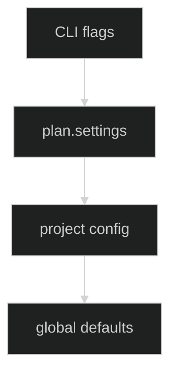
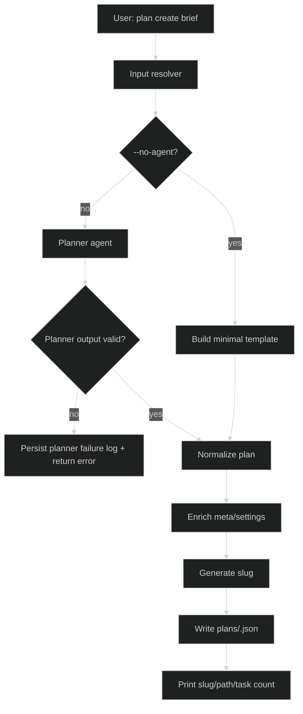
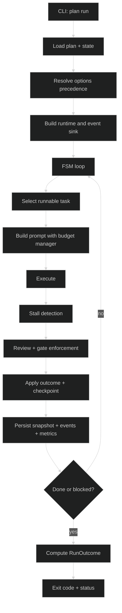
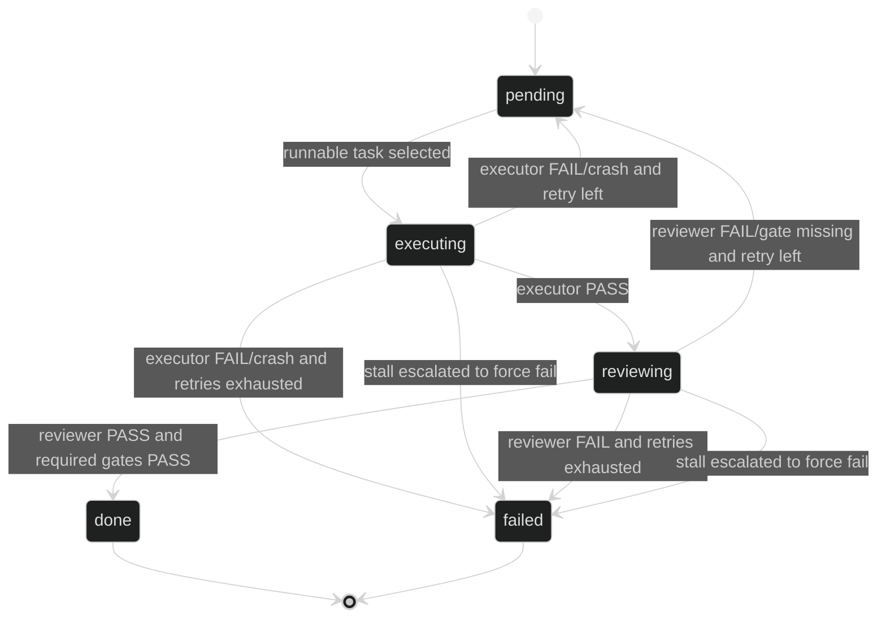
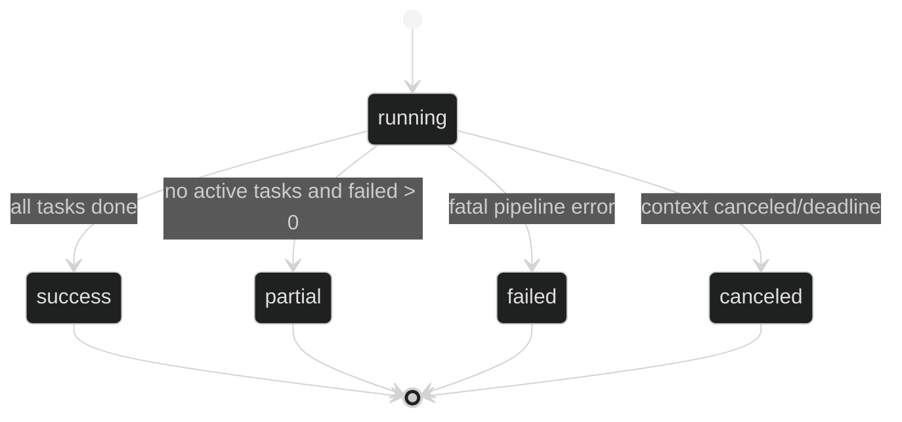

# Task orchestration

Praetor orchestrates plans with a strict JSON schema (`schema_version = 1`) and a Plan -> Execute -> Review loop.

## CLI workflows

### Create a plan (agent-assisted)

```bash
praetor plan create "Implement user authentication with JWT and tests"
praetor plan create --from-file docs/brief.md
cat brief.md | praetor plan create --stdin
```

Useful flags:

- `--planner <agent>` and `--planner-model <model>`: override planner defaults.
- `--slug <slug>`: force a specific slug.
- `--dry-run`: print generated JSON without writing a file.
- `--no-agent`: generate a minimal valid template without calling a planner.
- `--force`: overwrite an existing plan file.

### Run a plan

```bash
praetor plan run my-plan \
  --runner direct \
  --executor codex \
  --reviewer claude \
  --executor-model gpt-5-codex \
  --reviewer-model opus \
  --budget-execute 120000 \
  --budget-review 80000 \
  --stall-enabled \
  --stall-window 3 \
  --stall-threshold 0.67
```

### Diagnose a run

```bash
praetor plan diagnose my-plan --query errors
praetor plan diagnose my-plan --query stalls --format json
praetor plan diagnose my-plan --query costs
```

Allowed queries: `errors`, `stalls`, `fallbacks`, `costs`, `all`.

## Plan schema v1

Canonical schema file: [`docs/schemas/plan.v1.schema.json`](schemas/plan.v1.schema.json)

```json
{
  "schema_version": 1,
  "name": "Implementar autenticação de usuários",
  "summary": "Adicionar fluxo de login seguro com testes e documentação mínima.",
  "meta": {
    "source": "agent",
    "created_at": "2026-02-27T10:30:00Z",
    "created_by": "hugo",
    "generator": {
      "name": "praetor",
      "version": "0.15.0",
      "prompt_hash": "sha256:4d2f..."
    }
  },
  "settings": {
    "agents": {
      "planner": {
        "agent": "claude",
        "model": "opus"
      },
      "executor": {
        "agent": "codex",
        "model": "gpt-5-codex"
      },
      "reviewer": {
        "agent": "claude",
        "model": "opus"
      }
    },
    "execution_policy": {
      "max_total_iterations": 200,
      "max_retries_per_task": 3,
      "timeout": "1h",
      "budget": {
        "execute": 120000,
        "review": 80000
      },
      "stall_detection": {
        "enabled": false,
        "window": 3,
        "threshold": 0.67
      }
    }
  },
  "quality": {
    "evidence_format": "gates_v1",
    "required": ["tests", "lint"],
    "optional": ["coverage>=80"]
  },
  "tasks": [
    {
      "id": "TASK-001",
      "title": "Criar módulo de autenticação",
      "description": "Implementar hash e verificação de senha com bcrypt",
      "acceptance": [
        "Todos os testes da camada auth passando",
        "Senha nunca é persistida em texto puro"
      ],
      "depends_on": []
    }
  ]
}
```

### Required fields

- `schema_version` (must be `1`)
- `name`
- `settings.agents.executor.agent`
- `settings.agents.reviewer.agent`
- `tasks` (non-empty)
- `tasks[].id` (unique, non-empty)
- `tasks[].title` (non-empty)
- `tasks[].acceptance` (non-empty array)

### Rejected legacy fields

Top-level:

- `title`
- `execution`
- `origin`

Task-level:

- `executor`
- `reviewer`
- `model`
- `criteria`

Other legacy settings:

- `settings.plan`
- `settings.agents.<role>.max_iterations`

Plan loading uses two-pass validation:

1. Legacy detection with migration-oriented errors.
2. Strict decode with `DisallowUnknownFields()`.

No compatibility mode or migration layer exists. Non-v1 plans fail fast and must be recreated.

## Configuration precedence

The effective runtime configuration is resolved in this order:

1. Explicit CLI flags
2. `plan.settings` (`agents` + `execution_policy`)
3. Resolved Praetor config (`$PRAETOR_CONFIG` or `<praetor-home>/config.toml`, including project section)
4. Built-in defaults



## `plan create` flow



## `plan run` flow



## Task state machine (with stall guard)



## Run outcome and exit codes

Run outcome is persisted in state and snapshots.



| Exit code | Outcome | Meaning |
|---|---|---|
| `0` | `success` | all tasks completed |
| `1` | `failed` | fatal pipeline failure |
| `2` | `canceled` | canceled by signal/context/timeout |
| `3` | `partial` | mix of `done` and `failed` tasks |

## Context budget manager

`ContextBudgetManager` keeps prompts bounded per phase.

Default budgets:

- Execute: `120000` chars
- Review: `80000` chars

Token estimate heuristic:

- `estimated_tokens = len(prompt) / 4`

Behavior:

- Execute phase truncates retry feedback first.
- Review phase truncates `executor_output` first, then `git_diff`.
- Performance metrics are appended to `runtime/<run-id>/diagnostics/performance.jsonl`.
- Truncation emits `budget_warning` events.

## Stall detection

When enabled, stall detection fingerprints normalized outputs per `task+phase` with a sliding window.

Normalization removes high-variance noise:

- timestamps
- UUIDs
- absolute paths
- extra whitespace

Escalation policy:

1. try fallback agent (if configured)
2. reduce phase budget
3. mark task as failed (`stalled`)

Events emitted: `task_stalled` with similarity, window size, and action.

## Backpressure via quality gates

`quality.required` enforces evidence-based completion.

Executor output format:

```text
GATES:
- tests: PASS (42 tests passed, 0 failed)
- lint: PASS (no issues found)
```

Rules:

- Missing required gate => review rejection.
- Required gate with `FAIL` => review rejection.
- Optional gates are logged (`gate_result`) but do not block completion.

## Diagnostics and observability

Run artifacts:

- `runtime/<run-id>/events.jsonl`
- `runtime/<run-id>/diagnostics/performance.jsonl`
- `runtime/<run-id>/snapshot.json`

Event schema (v1):

```json
{
  "schema_version": 1,
  "event_type": "agent_start",
  "timestamp": "2026-02-27T10:30:00Z",
  "run_id": "20260227-...",
  "task_id": "TASK-001",
  "phase": "execute",
  "data": {}
}
```

Supported event types:

- `agent_start`
- `agent_complete`
- `agent_error`
- `agent_fallback`
- `task_stalled`
- `budget_warning`
- `gate_result`

`plan diagnose` reads these files and filters by query (`errors`, `stalls`, `fallbacks`, `costs`, `all`).
