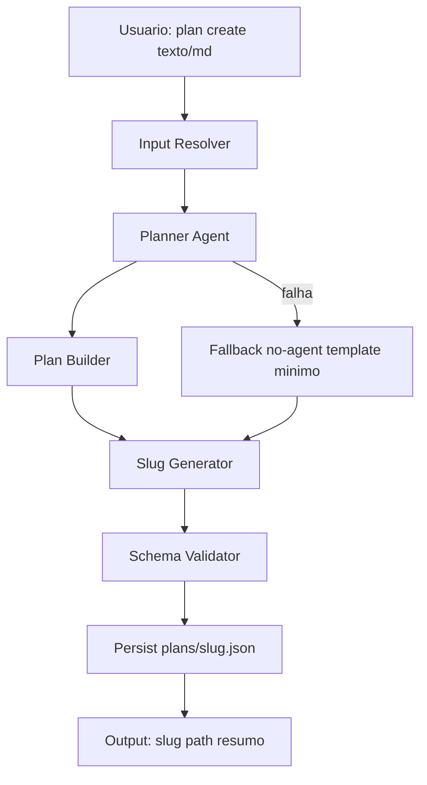
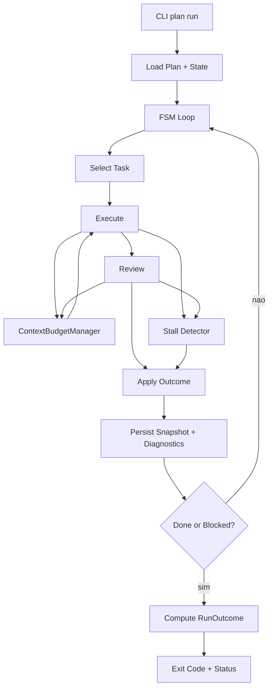
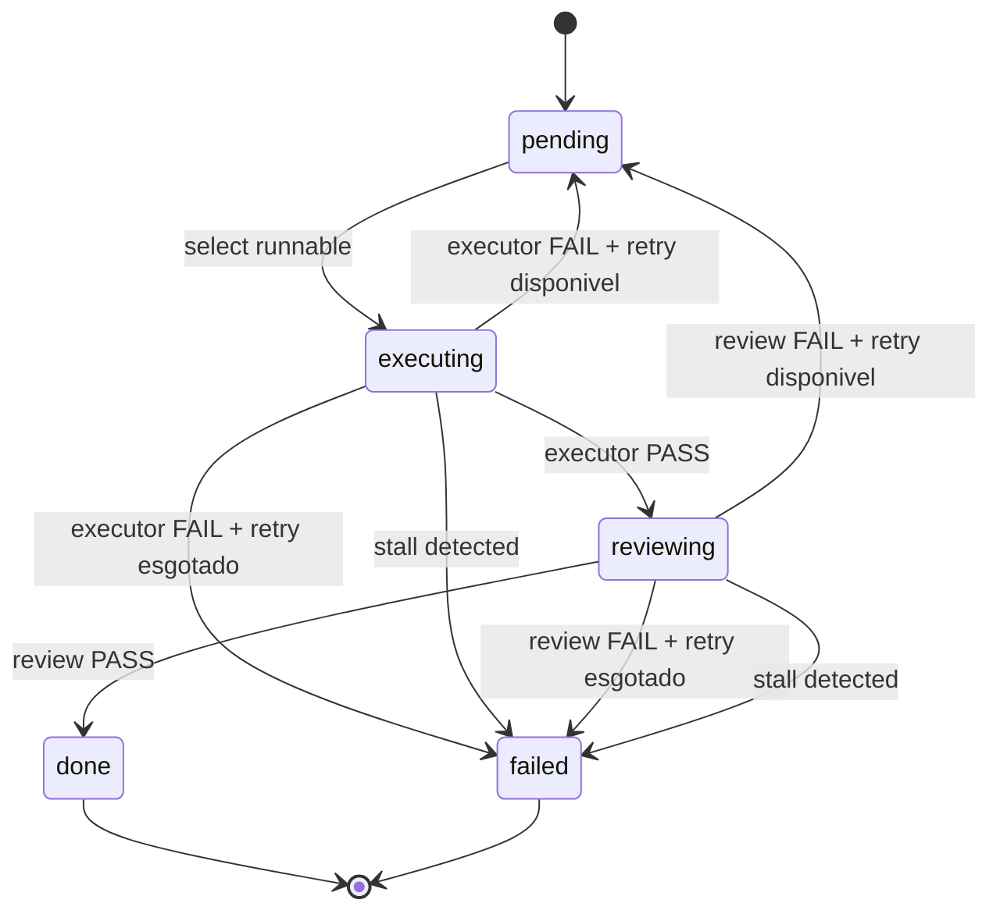
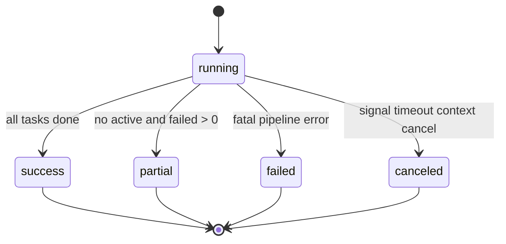

# RFC-014: Evolução do Fluxo de Orquestração do Praetor Inspirada no Ralph Orchestrator

- **Status:** Proposed
- **Data:** 2026-02-27
- **Autores:** Time Praetor
- **Relaciona-se a:** RFC-009, RFC-010, RFC-012, RFC-013
- **Fonte externa de estudo:** documentação pública do Ralph Orchestrator
- **Plano de execucao:** [`docs/plans/RFC-014-plano-execucao.md`](/home/hugo/Workspace/opus-domini/praetor/docs/plans/RFC-014-plano-execucao.md)

## 1. Motivação

O Praetor já possui um núcleo de orquestração robusto para CLI: FSM explícita, isolamento por worktree, snapshots transacionais, retries por tarefa, fallback por classe de erro e gate de revisão.

Mesmo com essa base sólida, o estudo comparativo com o Ralph revelou oportunidades claras de evolução de fluxo em oito dimensões:

1. semântica de sucesso final da execução
2. prevenção de thrash/loop por similaridade de saída
3. controle explícito de orçamento de contexto e custo
4. backpressure declarativo com evidência verificável
5. observabilidade unificada de execução (eventos + diagnóstico)
6. coordenação opcional orientada a eventos sem sair do contexto CLI
7. criação de plano assistida por agente a partir de texto/markdown
8. simplificação do schema de plano com agentes/modelos no nível do plano

Esta RFC transforma esses aprendizados em um plano incremental e substitutivo da versão atual do Praetor.

---

## 2. Diagnóstico Atual do Praetor

## 2.1 Pontos fortes atuais

1. fluxo Plan -> Execute -> Review com transições validadas
2. persistência por plano (`state`, `checkpoints`, `costs`, `logs`, `runtime`)
3. recuperação via snapshot local com checksum
4. fallback por classe de erro (`transient`, `auth`, etc.)
5. isolamento por worktree e trilha de auditoria por run

## 2.2 Lacunas priorizadas

1. run pode encerrar com tarefas `failed` e ainda ser considerado finalizado (sem distinção nítida de sucesso pleno)
2. ausência de detecção explícita de saída repetitiva por tarefa (thrash loop)
3. orçamento de contexto não é tratado como recurso de primeira classe no pipeline
4. backpressure não é declarativo no plano; fica distribuído em prompts/critério textual
5. `events.jsonl` é criado no runner, mas o runtime padrão não recebe `RuntimeDeps` por padrão
6. evento semântico de fallback (`agent_fallback`) não é emitido no caminho normal
7. `plan create` exige slug + edição manual de JSON (experiência pouco amigável)
8. plano permite `executor/reviewer/model` por task, aumentando ruído e inconsistência operacional

---

## 3. Objetivos

1. introduzir semântica explícita de resultado final (`success`, `partial`, `failed`, `canceled`)
2. reduzir loops improdutivos com detecção de similaridade e política de escalonamento
3. tornar contexto/custo previsíveis com orçamento por fase e métricas de consumo
4. formalizar backpressure como contrato declarativo e verificável por evidência
5. consolidar diagnósticos JSONL por run para investigação e operação
6. habilitar coordenação orientada a eventos de forma opcional e nativa em CLI
7. transformar `plan create` em fluxo assistido por agente, com entrada textual/markdown
8. adotar schema de plano com seleção de agentes/modelos no nível do plano

## 3.1 Não objetivos

1. não introduzir dashboard web como parte deste RFC
2. não substituir o modelo principal de plano DAG por eventos (eventos serão opcionais)
3. não quebrar o contrato atual de providers/adapters em `exec`
4. não manter suporte ao formato de plano atual após entrada do novo schema

---

## 4. Princípios de Projeto

1. **Contexto fresco é confiabilidade**: evitar acúmulo cego de histórico em prompts longos
2. **Backpressure sobre prescrição**: exigir evidências objetivas em vez de instruções procedurais rígidas
3. **Plano é descartável**: priorizar regeneração/replanejamento barato sobre remendo de fluxo quebrado
4. **Disco é estado**: consolidar trilha de execução em artefatos auditáveis no filesystem
5. **Sinais, não scripts**: usar gates/eventos/métricas como sinalização de qualidade e progresso
6. **UX CLI-first**: operações críticas devem ser naturais via terminal, sem edição manual de JSON

---

## 5. Proposta Técnica

## 5.1 `plan create` assistido por agente

Substituir o fluxo atual (slug + arquivo vazio para edição manual) por criação assistida:

1. `praetor plan create "<brief em texto>"`
2. `praetor plan create --from-file requirements.md`
3. `praetor plan create --stdin` (lê markdown de stdin)

### Comportamento

1. Praetor recebe o brief (texto plain ou markdown)
2. chama o agente de planejamento padrão
3. agente produz plano estruturado no novo schema oficial
4. Praetor gera slug automaticamente a partir do nome do plano
5. valida o plano gerado
6. persiste `plans/<slug>.json`

### Flags adicionais

1. `--planner <agent>` para override do agente de planejamento
2. `--model <model>` para override de modelo do planner
3. `--slug <slug>` para forçar slug manual
4. `--dry-run` para exibir JSON sem persistir
5. `--no-agent` para fallback local (gera template mínimo)

### Regras de slug

1. derivado de `name` do plano (`slugify`)
2. colisão resolve com sufixo incremental (`-2`, `-3`, ...)
3. `--slug` prevalece sobre geração automática

## 5.2 Schema de plano oficial com agentes/modelos por plano

Remover seleção de agente/modelo por task. Seleção passa a ser exclusivamente por plano.

Exemplo de schema:

```json
{
  "name": "Implementar autenticação de usuários",
  "summary": "Adicionar fluxo de login seguro com testes e documentação mínima.",
  "execution": {
    "planner_agent": "claude",
    "executor_agent": "codex",
    "reviewer_agent": "claude",
    "planner_model": "sonnet",
    "executor_model": "o3",
    "reviewer_model": "sonnet"
  },
  "quality": {
    "required": ["tests", "lint", "typecheck"],
    "optional": ["coverage>=80"]
  },
  "tasks": [
    {
      "id": "TASK-001",
      "title": "Criar módulo de autenticação",
      "description": "Implementar hash e verificação de senha",
      "criteria": "Todos os testes da camada auth passando",
      "depends_on": []
    },
    {
      "id": "TASK-002",
      "title": "Expor endpoint de login",
      "description": "Adicionar endpoint POST /login",
      "criteria": "Credenciais válidas retornam 200",
      "depends_on": ["TASK-001"]
    }
  ]
}
```

### Ruptura de contrato (quebra planejada)

1. parser aceita apenas o novo schema a partir da entrega da Fase 0
2. campos por task (`executor`, `reviewer`, `model`) são rejeitados imediatamente
3. mensagens de erro orientam recriação do plano via `praetor plan create` assistido

## 5.3 Semântica de sucesso final de run

Adicionar `RunOutcome` explícito:

1. `success`: todas as tarefas em `done`
2. `partial`: sem tarefas ativas, mas com uma ou mais tarefas `failed`
3. `failed`: erro fatal de pipeline
4. `canceled`: cancelamento por contexto/sinal

### Mudanças

1. persistir outcome em snapshot/meta
2. atualizar `plan status` com outcome final
3. revisar exit codes:
   - `0` para `success`
   - `3` para `partial` (proposto)
   - não-zero para `failed` e `canceled`

## 5.4 Detecção de thrash loop por tarefa

1. manter janela deslizante por tarefa/fase (`execute`, `review`)
2. calcular similaridade de saída com threshold configurável
3. ao detectar recorrência:
   - emitir `task_stalled`
   - tentar escalonamento (fallback, compressão de contexto)
   - marcar `failed` com razão `stalled` se persistir

## 5.5 Backpressure declarativo

1. bloco `quality` no plano (global e opcional por task para reforço de gate)
2. executor retorna evidência estruturada dos gates
3. reviewer valida evidência e reprova quando insuficiente
4. sem `quality`, fluxo compatível com comportamento atual

## 5.6 Gerenciador de orçamento de contexto

Adicionar `ContextBudgetManager` no pipeline de prompts:

1. orçamento por fase (`plan`, `execute`, `review`)
2. truncamento/sumarização determinística de `diff`, output e feedback
3. métricas por iteração (`prompt_bytes`, `estimated_tokens`, truncamentos)
4. limiares de aviso e limite duro configuráveis

## 5.7 Observabilidade e diagnósticos unificados

1. ligar `RuntimeDeps.EventSink` ao runtime efetivo
2. emitir `agent_fallback` quando fallback ocorrer
3. padronizar diagnósticos em `runtime/<run-id>/diagnostics/`:
   - `events.jsonl`
   - `performance.jsonl`
   - `errors.jsonl`
   - `transitions.jsonl`
4. novo comando: `praetor plan diagnose <slug> [--run-id <id>] [--format json|table]`

## 5.8 Coordenação opcional orientada a eventos (CLI)

1. bloco opcional `workflow.events`
2. roteamento por `trigger -> role`
3. fallback automático para DAG padrão se ausente

---

## 6. Diagramas de Arquitetura e FSM

## 6.1 Arquitetura de `plan create` assistido



## 6.2 Arquitetura de `plan run` evoluído



## 6.3 FSM de tarefa com stall guard



## 6.4 FSM de outcome final da execução



---

## 7. Plano de Implementação (Fases)

## Fase 0 - `plan create` assistido + novo schema foundation

1. `F0-01` Implementar ingestão de brief (arg, file, stdin)
2. `F0-02` Invocar planner no `plan create`
3. `F0-03` Gerar slug automático e persistir plano validado
4. `F0-04` Definir parser e validação do novo schema
5. `F0-05` Remover suporte a agente/modelo por task
6. `F0-06` Atualizar docs e exemplos para o novo schema

**Critério de aceite:** usuário cria plano sem editar JSON manualmente e plano persiste no novo schema.

## Fase 1 - Foundation de observabilidade

1. `F1-01` Ligar `RuntimeDeps.EventSink` no bootstrap
2. `F1-02` Garantir emissão de `agent_start`, `agent_complete`, `agent_error`, `agent_fallback`
3. `F1-03` Expandir logger default para sucesso em verbose
4. `F1-04` Testes de integração de `events.jsonl`

**Critério de aceite:** eventos de runtime consistentes em `tmux`, `direct` e `pty`.

## Fase 2 - Semântica de outcome final

1. `F2-01` Introduzir `RunOutcome` no domínio/snapshot
2. `F2-02` Atualizar cálculo de status final do run
3. `F2-03` Atualizar `plan status` e exit codes
4. `F2-04` Testes de regressão (`success`, `partial`, `failed`, `canceled`)

**Critério de aceite:** run parcial não é confundido com sucesso pleno.

## Fase 3 - Loop/thrash detection

1. `F3-01` Implementar fingerprint e janela deslizante por tarefa/fase
2. `F3-02` Integrar com retry/fallback
3. `F3-03` Registrar `task_stalled` em diagnósticos
4. `F3-04` Testes de estabilidade do detector

**Critério de aceite:** loops repetitivos disparam escalonamento e encerram com motivo explícito.

## Fase 4 - Backpressure declarativo

1. `F4-01` Injetar `quality.required` no prompt do executor
2. `F4-02` Exigir evidência estruturada de gates
3. `F4-03` Evoluir parser/reviewer para validação de evidência
4. `F4-04` Garantir comportamento padrão quando `quality` estiver ausente

**Critério de aceite:** gates obrigatórios bloqueiam conclusão sem evidência válida.

## Fase 5 - Context budget manager

1. `F5-01` Criar `ContextBudgetManager` por fase
2. `F5-02` Integrar truncamento/sumarização em prompts
3. `F5-03` Persistir métricas de orçamento por iteração
4. `F5-04` Expor configuração via CLI/config

**Critério de aceite:** tamanho de prompt previsível e auditável.

## Fase 6 - Diagnose CLI e schema de diagnósticos

1. `F6-01` Versionar schema JSONL de diagnóstico
2. `F6-02` Implementar `praetor plan diagnose`
3. `F6-03` Queries padrão (erro, fallback, stall, custo)
4. `F6-04` Documentar playbook operacional

**Critério de aceite:** troubleshooting orientado por diagnóstico estruturado.

## Fase 7 - Workflow opcional orientado a eventos

1. `F7-01` Prototipar parser de `workflow.events`
2. `F7-02` Implementar roteador de trigger minimalista
3. `F7-03` Integrar com snapshot/checkpoint
4. `F7-04` Feature flag experimental

**Critério de aceite:** fluxo event-driven opt-in sem regressão do DAG padrão.

---

## 8. Backlog Atômico (Ordem Recomendada)

1. `T-001` Novo `plan create` com entrada de texto/markdown
2. `T-002` Planner invocation + geração automática de slug
3. `T-003` Novo schema (`name`, `summary`, `execution`, `tasks`)
4. `T-004` Remoção de agente/modelo por task no parser e no domínio
5. `T-005` Wiring de `RuntimeDeps` e eventos runtime
6. `T-006` Emissão de `agent_fallback`
7. `T-007` `RunOutcome` + exit codes
8. `T-008` Detector de stall por tarefa/fase
9. `T-009` Escalonamento de stall no pipeline
10. `T-010` Backpressure declarativo + parser de evidência
11. `T-011` `ContextBudgetManager` + métricas
12. `T-012` Schema JSONL versionado + `plan diagnose`
13. `T-013` POC `workflow.events`
14. `T-014` Suíte de regressão e docs finais

---

## 9. Métricas de Sucesso

1. redução do tempo de criação de plano (brief -> plano salvo)
2. queda no número de planos editados manualmente em JSON
3. redução de runs encerrados em `partial` após ajustes de fluxo
4. redução de retries improdutivos por detecção de stall
5. redução da variância de tamanho de prompt por fase
6. aumento da taxa de diagnóstico resolvido sem reprodução manual

---

## 10. Riscos e Mitigações

1. **Risco:** planner gerar plano inválido no `plan create`
- **Mitigação:** validação rígida + fallback `--no-agent` + `--dry-run`

2. **Risco:** quebra imediata de planos no formato antigo
- **Mitigação:** erro explícito e fluxo simples de recriação com `plan create` assistido

3. **Risco:** falsos positivos em loop detection
- **Mitigação:** threshold configurável + janela curta + recorrência mínima

4. **Risco:** overhead de I/O de diagnósticos
- **Mitigação:** retenção e nível de diagnóstico configuráveis

---

## 11. Rollout

1. Fase 0 e Fase 1 em rollout inicial
2. Fases 2 a 6 com ativação progressiva por feature flag
3. Fase 7 como experimental por ao menos um ciclo de release
4. remoção de campos por task já na entrega da Fase 0

---

## 12. Definição de Concluído (DoD)

Esta RFC será considerada concluída quando:

1. `plan create` aceitar texto/markdown e gerar slug + plano automaticamente
2. novo schema estiver ativo com agentes/modelos no nível do plano
3. outcome final de run estiver explícito e consistente no CLI
4. stall detection estiver ativo com testes e eventos de diagnóstico
5. backpressure declarativo (`quality`) estiver funcional e compatível
6. context budget estiver disponível com métricas por fase
7. `plan diagnose` estiver operacional com schema JSONL documentado
8. diagramas e documentação refletirem o novo fluxo arquitetural
